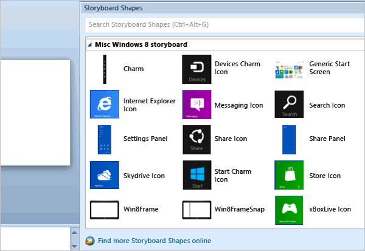
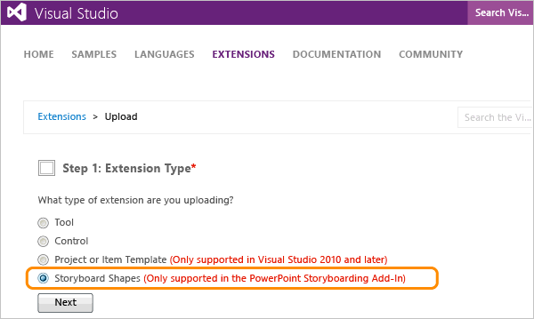

# Add and share storyboard shapes

[!INCLUDE [temp](../../_shared/version-vsts-tfs-all-versions.md)]

Adding to your gallery of storyboard shapes can boost your ability to [storyboard your ideas using PowerPoint Storyboarding](storyboard-your-ideas-using-powerpoint.md). You can import storyboard shapes created by other members of your team. To share custom shapes that you've created, you can export them to a storyboard shapes file.  
  
>[!IMPORTANT]  
>The Visual Studio Gallery for PowerPoint Storyboarding has been deprecated. You may find storyboard shapes from the links provided in this blog post, [Storyboard shapes extensions being deprecated from Visual Studio Marketplace](https://blogs.msdn.microsoft.com/visualstudioalm/2016/11/16/storyboard-shapes-extensions-being-deprecated-from-visual-studio-marketplace/).  

## Find storyboard shapes and import them  
  
0.  If you're interfacing with TFS 2017 or VSTS, you must have [Office PowerPoint 2010 or later version installed](https://www.microsoftstore.com/store/msusa/en_US/pdp/productID.323024400). For version compatibility, see [Requirements and compatibility, Office](../../../accounts/requirements.md#office). If you're interfacing with TFS 2013 or TFS 2015, you must have Office PowerPoint 2007 or later version installed.  
  
0.  If you haven't installed Visual Studio, you'll need to [install Visual Studio Community or other version](https://www.visualstudio.com/downloads/) or  [Team Foundation Server Office® Integration](https://go.microsoft.com/fwlink/?LinkId=832492&clcid=0x409) to install the Storyboarding add-in to PowerPoint.  
  
0.  Open the [blog post](https://blogs.msdn.microsoft.com/visualstudioalm/2016/11/16/storyboard-shapes-extensions-being-deprecated-from-visual-studio-marketplace/) and click a link to download the corresponding storyboard shapes file. For example, download the [Windows 8 shapes and icons](https://visualstudiogallery.msdn.microsoft.com/7d745871-cf6a-47cd-a614-8453fa91f608/file/79318/1/Misc%20Windows%208%20storyboard.sbsx) 

0.  Save the file to the Shapes folder (*Drive*:Program Files\Common Files\microsoft shared\Team Foundation Server\14.0\PowerPoint\Shapes).  
  
0.  Close and reopen PowerPoint.  
  
    > [!TIP]  
    > If you save the download file to a location other than the Shapes folder, you can import the file using **Import Shapes** from the Storyboarding tab.  If you don't see the Storyboarding tab, you don't have the Team Foundation add-in for PowerPoint Storyboarding. See step 2.   
  
0.  Start using the Misc Windows 8 shapes.  
  
       
  
## Share shapes that you create with your team  
 At any time, you can export custom storyboard shapes that you've created and share them with your team. You can create storyboard shapes with any combination of PowerPoint shapes, screenshots, inserted images, or storyboard shapes.  
  
1.  Add each of your storyboard shapes to the **My Shapes** category and name it. If you don't see the Storyboarding tab, you don't have the Team Foundation add-in for PowerPoint Storyboarding. See step 2 in the previous procedure.   
  
       
  
    > [!TIP]  
    >  To update the shape, highlight it, open the context menu, and then choose **Update My Shape**.  
  
2.  Export your shapes to a storyboard shapes file (.sbsx) and share it with other team members who use PowerPoint Storyboarding.  
  
       
 
<!--- 
## You can share your shapes with the Visual Studio community, too  
 Sell or share your custom storyboard shapes through the Visual Studio gallery.  
  
1.  Open the [Visual Studio Extensions Upload](http://visualstudiogallery.msdn.microsoft.com/site/upload) page.  
  
       
  
2.  Specify the storyboard shapes extension type.  
  
       
  
3.  Complete the next two steps and add your contribution.  

 In addition, you can author storyboard shapes with custom resize logic using the Storyboard Shapes Authoring Tool. To get this tool, download [Visual Studio Team Foundation Server Power Tools](http://go.microsoft.com/fwlink/?LinkId=248625).  
-->  
## Related notes  
- [Storyboard your ideas using PowerPoint Storyboarding](storyboard-your-ideas-using-powerpoint.md).