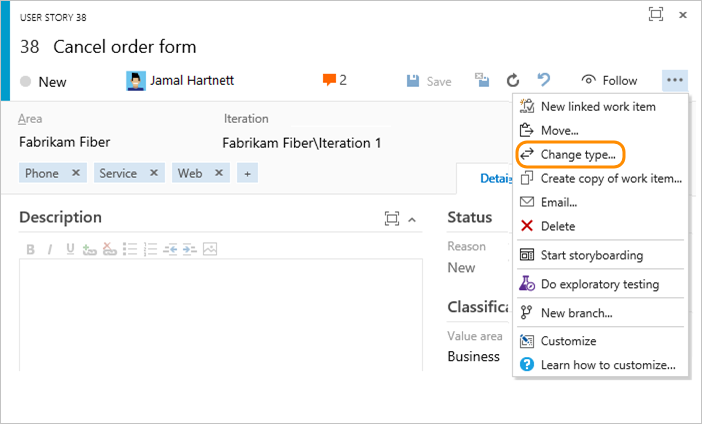
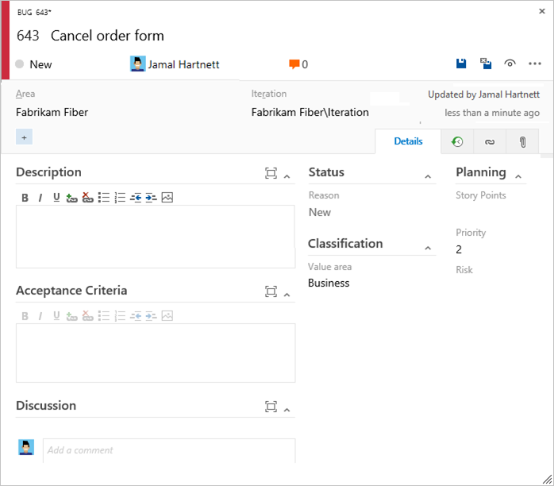
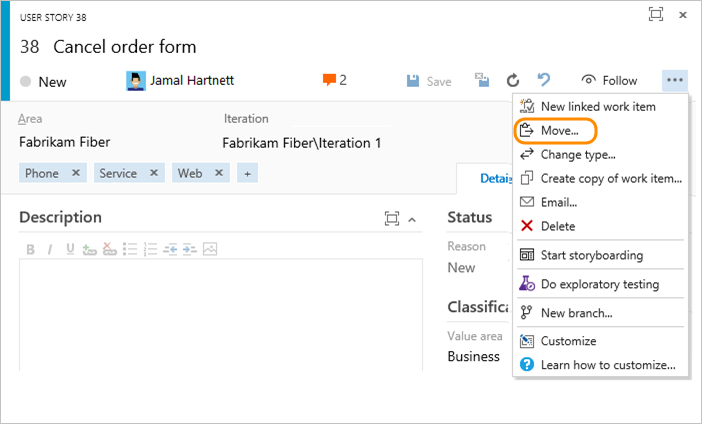
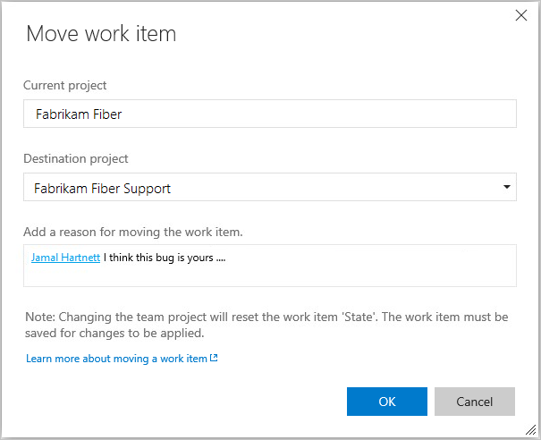
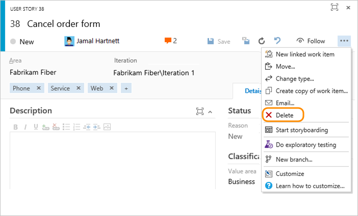
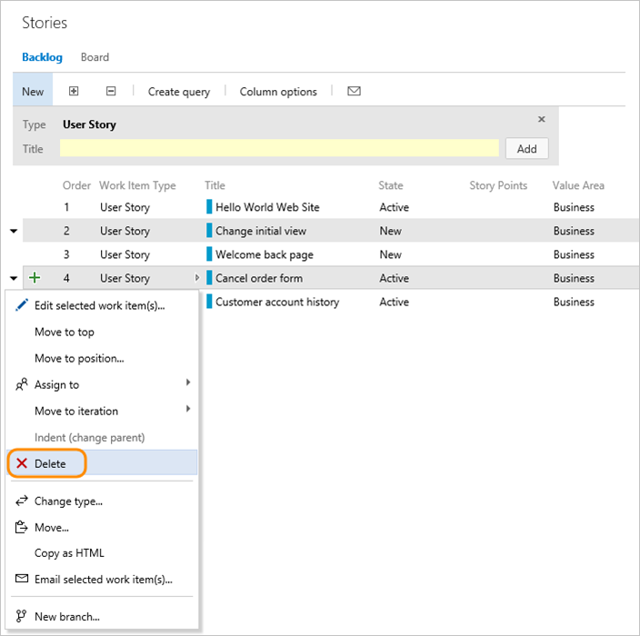
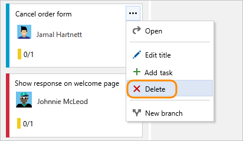

# Move, change, or delete work items 

[!INCLUDE [temp](../_shared/dev15-version-header.md)]

Often times you find that someone created a work item of the wrong work item type (WIT) or within an incorrect team project. You can correct these issues for individual work items or bulk modify several work items. You can also remove work items added to your backlog or task board that aren't relevant anymore.  

In this topic you'll learn:  

> [!div class="checklist"] 
> * How to change the work item type of one or more work items (VSTS)  
> * How to move one or more work items to another team project  (VSTS)     
> * How to remove work items from the backlog by changing the State to Removed     
> * How to delete work items and test artifacts  
> * How to restore or permanently delete work items (web portal)
> * How to permanently delete work items (command-line tool)  
> * What permissions are required to delete work items and test artifacts    

>[!NOTE]  
>**Feature availability:** The following features are available from VSTS (cloud service) or from the web portal of the listed on-premises TFS version or a later version. Those not annotated are available from all platforms and versions. Visit the [Visual Studio Downloads page](https://www.visualstudio.com/downloads/download-visual-studio-vs) to get the latest TFS update. Additional resources may be required as annotated. To determine your platform or TFS version, see [Provide product and content feedback](../../user-guide/provide-feedback.md#platform-version) 

You only have access to those actions that are supported on your platform and for which you have permissions. If you are a member of the Contributors group (anyone who has been added as a team member) or Project Administrators groups, you have access to the following features. For a simplified view of permissions assigned to built-in groups, see [Permissions and access](../../security/permissions-access.md). 


> [!div class="mx-tdBreakAll"]  
> |Contributors|Project Administrators|  
> |-------------|----------|---------|  
> |- [Change work item type](#change-type)&#160;<sup>1, 2</sup> (VSTS)<br/>- [Remove work items (change State)](#remove)&#160;<sup>2, 3</sup><br/>- [Delete work items](#delete)&#160;<sup>1, 2</sup>  (VSTS, TFS 2015.2)<br/>- [Restore work items](#restore)&#160;<sup>1, 2, 5</sup> (VSTS, TFS 2015.2)|- [Move a work item to another team project](#move)&#160;<sup>1,&#160;2,&#160;4</sup><br/>- [Permanently delete work items (web portal)](#restore)&#160;<sup>1, 2, 5</sup> (VSTS, TFS 2015.2)<br/>- [Permanently delete work items (command-line tool)](#perm-delete)&#160;<sup>5</sup><br/>- [Permanently delete test artifacts](#delete-test)&#160;<sup>6</sup> (TFS 2017.1)|  


**Notes:**  

<ol>
<li>You can't change type, move work items, or delete/restore work items whose WITs support test management or that belong to the [Hidden Types Category](../work-items/agile-glossary.md#hidden-types). This includes all work items that track tests&mdash;such as test cases, shared steps, and shared parameters&mdash;code review requests and responses, and feedback requests and responses.   
</li>
<li>From the web portal, you can[ multi-select several work items](bulk-modify-work-items.md) from a backlog or query results page and perform a bulk update using the associated feature. </li>
<li>Changing the State to Remove causes work items to be removed from a backlog or board view (product, portfolio, and sprint backlogs, Kanban board, and task boards).</li>
<li>To move work items to another team project, you must be a member of the Project Administrators group or be [granted explicit permissions to move work items](../how-to/set-permissions-access-work-tracking.md#move-delete-permissions).</li>
<li>To permanently delete work items from the web portal, you must be a member of the Project Administrators group or be [granted explicit permissions to delete or restore work items](../how-to/set-permissions-access-work-tracking.md#move-delete-permissions).</li>
<li>To delete test artifacts, the following restrictions and operations apply:  
<ul>
<li>You must be a member of the Project Administrators group or have the [**Delete test artifacts** permission set to **Allow**](../how-to/set-permissions-access-work-tracking.md#delete-test-permissions). You must also have permissions set to [manage test plans and test suites](../how-to/set-permissions-access-work-tracking.md#delete-test-permissions), and your [access level set to Advanced](../../security/change-access-levels.md), which provides access to the full Test feature set.</li> 
<li>Users with Basic access and with permissions to permanently delete work items and manage test artifacts can only delete orphaned test cases. That is, they can delete test cases created from the work hub that aren't linked to any test plans or test suites. </li>
<li>When you delete a test plan, test suite, test case, shared steps, or shared parameters, you not only permanently delete them, you also delete all associated test artifacts such as test results.</li>
<li>You can't bulk delete test artifacts. If test artifacts are part of a bulk selection to be deleted, all other work items except the test artifact(s) will get deleted.</li>
</ul>
</li>
</ol>


>[!TIP]  
>To change, move, delete, or restore several work items at the same time, see [Bulk modify work items](bulk-modify-work-items.md). 


[!INCLUDE [temp](../_shared/image-differences.md)]  

<a id="change-type"> </a>  
## Change the work item type 

>[!NOTE]  
><b>Feature availability: </b> The **Change type&hellip;** menu option is supported only from VSTS. You can't change the work item type of work items associated with test management. Both Contributors and users assigned Stakeholder access can change the work item type.       

Changing the work item type refreshes the work item form with the fields defined for the type selected. For example, you can change a bug to a task and the form will refresh with the fields defined for a task. 

You can change a single work item or several [multi-selected work items](bulk-modify-work-items.md) to a new type. 


>[!TIP]    
When you connect to TFS, you can't change the work item type for an existing work item, but you can [copy the work item and specify a new type](../backlogs/copy-clone-work-items.md#copy-clone). Also, if you have several work items with type changes you want to make, you can [export them using Excel](../backlogs/office/bulk-add-modify-work-items-excel.md), and then re-add them as a new type. 

1. Select the  Change type... option from the work item form's  Actions menu.    

	  

	Or, from the backlog or query results page, multi-select several work items whose type you want to change. You can select several work items of the same type or different type so long as you want to change them all to the same work item type. 

	Click  to open the context menu of one of the selected work items, and choose the  **Change type&hellip;** option.    

	>[!IMPORTANT]   
	>From the Query results page, the **Change type&hellip;** option becomes unavailable if you have checked the Query Editor's **Query across projects** checkbox. 

	

2. Select the type and optionally enter a comment.  

	  

	Comments are automatically added to the [Discussion control](../work-items/work-item-form-controls.md#discussion). 

3. Save the work item to complete the change.  
 
	> [!NOTE]     
	> The system automatically resets the State and Reason fields to the default initial values of the specified type.  

	

4. From the Query results page, you must save all work items that you bulk-modified. When you bulk modify items from the backlog, they are automatically saved. Work items shown in bold text indicate that local changes have not yet been saved to the data store. The system automatically saves each work item. Refresh the page to reflect your changes.   


<a id="move"> </a>  
## Move a work item to another team project  

>[!NOTE]    
><b>Feature availability: </b> The **Move to team project&hellip;** menu option is supported only from VSTS. You can only move work items from one team project to another team project within the account or collection. You can't move work items associated with test management.   

When you discover that a work item belongs to a different team project within your account or collection, you can move it where it belongs. You can move a single work item or several [multi-selected work items](bulk-modify-work-items.md). 

1. Open the work item and choose the  Move... option from the work item form's  Actions menu.    

	  

	If you don't see the option, then you haven't been granted [permissions to move work items out of the project](../how-to/set-permissions-access-work-tracking.md#move-delete-permissions).  

	Or, from the backlog or query results page, multi-select several work items whose type you want to change. You can select several work items of the same type or different type so long as you want to change them all to the same work item type. 

	Click  to open the context menu of one of the selected work items, and choose the  Move&hellip; option. 

2. Select the destination team project and optionally enter a comment.  

	  

	Comments are automatically added to the [Discussion control](../work-items/work-item-form-controls.md#discussion) and an entry is made to the History control. Also, the system automatically resets the State and Reason fields to the default initial values for the work item type that you move.  
 

<a id="remove"> </a>  
## Remove work items by changing the State

By changing the State of a work item to Removed, you effectively remove it from all backlogs and boards.  


To cause removed items to not show up in queries, you must add a clause that indicates which states you want the query to filter for. 

<a id="delete"> </a> 
## Delete work items  

>[!NOTE]  
><b>Feature availability: </b> The Delete and Recycle bin features are available from VSTS and from the web portal for TFS 2015.2 or later versions. 

Deleted work items won't appear in your backlogs, boards, or queries. Deleted items are moved to a recycle bin from which you can recover them if needed. To delete a test case, test plan, or test suite, or other test-related WITS, see [Delete test artifacts](#delete-test). 

1. You can delete a work item from within the work item form, or by multi-selecting work items from a backlog or query results page.  

	  

	To delete work items, you must be a member of the Project Administrators group or have the **Delete work items in this project** set to Allow. By default, this permission is Not Set for Contributors. 
	- For VSTS and TFS 2015.2 and later versions, the Contributors group has **Delete and restore work items** at the project-level set to "Allow" by default. 
	- For TFS 2015.1 and earlier versions, the Contributors group has **Delete work items in this project** at the project-level set to "Not set" by default. This setting causes the Contributors group to inherit the value from the closest parent that has it explicitly set.     

2. Confirm you want to actually delete the item(s).  

	  

3. Using multi-select from a backlog or query results list, you can delete several work items at once. 

	 

4. You can also delete work items from your Kanban or task board. 

	

	Or, you can drag them to the  (Recycle bin). You can only access the (Recycle bin) from the Work hub. 


<a id="restore"> </a> 
## Restore or permanently delete work items   

# [Browser](#tab/browser)
>[!NOTE]  
><b>Feature availability: </b>The Delete and Recycle bin features are available from VSTS and from the web portal for TFS 2015.2 or later versions.  

1. To restore deleted items, open the Recycle bin from the web portal.  

	  

2.	Select the items you want to restore and then choose restore or to permanently delete the items.  

	 

	>[!NOTE] 
	>You'll only see the Permanently delete option if your [Permanently delete work items permission](../how-to/set-permissions-access-work-tracking.md#move-delete-permissions) is set to Allow.  

3.	Confirm your selection. 

# [Command Line](#tab/command-line)

<a id="perm-delete"> </a>    

Use the ```witadmin destroywi``` command to permanently remove work items from the data store. A permanent delete means all information in the WIT data store is deleted and cannot be restored nor reactivated.

You can run ```witadmin destroywi``` against an on-premises TFS server or VSTS account. 

1. Open a Command Prompt window where the latest version of Visual Studio is installed and enter:  

	```cd %programfiles(x86)%\Microsoft Visual Studio 14.0\Common7\IDE```  

	On a 32-bit edition of Windows, replace %programfiles(x86)% with %programfiles%.  

	The witadmin command-line tool installs with any version of Visual Studio. You can access this tool by installing the free version of Visual Studio Community. 

3.	To delete several work items from an account hosted on VSTS, enter the following specifying the account name and separating the IDs with commas.    

	```witadmin destroywi /collection:http://AccountName/DefaultCollection /id:12,15,23```

3.	To delete several work items from an on-premises collection, enter the server name and directory path to the collection. For example:   

	```witadmin destroywi /collection:http://TFSServerName:8080/tfs/DefaultCollection /id:12,15,23```
 
2.	To delete a single work item, simply enter the ID as shown:  

	```witadmin destroywi /collection:http://TFSServerName:8080/tfs/DefaultCollection /id:2003```  

	>[!NOTE] 
	>**Required permissions:** For VSTS and TFS 2015.2 or later versions, you must have [Permanently delete work items permission set to Allow](../how-to/set-permissions-access-work-tracking.md#move-delete-permissions). For TFS 2015.1 or earlier versions, you must be a member of the Project Administrators group of have Edit project-level information permissions set to Allow.    

---

<a id="delete-test"> </a> 
## Delete test artifacts  

>[!IMPORTANT]   
><b>Feature availability: </b> The permanently delete feature of test artifacts is available from the from the Test and Work hubs for VSTS and the web portal of TFS 2017.1 and later versions. 
>
>We only support permanent deletion of test artifacts such as test plans, test suites, test cases, shared steps and shared parameters. Deleted test artifacts won't appear in the recycle bin and cannot be restored. Deletion of test artifacts not only deletes the selected test artifact but also all its associated child items such as child test suites, test points across all configurations, testers (the underlying test case work item doesn't get deleted),  test results history, and other associated history.

1. To delete a test case, open it from the web portal and choose the Permanently delete option from the actions menu. (Bulk deletion is not supported from a query results page.)     

	  

	>[!NOTE] 
	>You'll only see the Permanently delete option if you have the necessary permissions and access. You must be a member of the Project Administrators group or have the [**Delete test artifacts** permission set to **Allow**](../how-to/set-permissions-access-work-tracking.md#delete-test-permissions). You must also have your [access level set to Advanced](../../security/change-access-levels.md), which provides access to the full Test feature set. Users with Basic access and with permissions to permanently delete work items and manage test artifacts can only delete orphaned test cases. That is, they can delete test cases created from the work hub that aren't linked to any test plans or test suites. 

2. Confirm you want to actually delete the item.  

	  

3. You can also delete test plans and test suites directly from the Test hub. 

	

4.	To delete shared steps and shared parameters you need to first manually remove all references to them before you can delete them. 
	
	
 
## Related notes   

To add fields or customize a work item form, see [Customize your work tracking experience](../customize/customize-work.md). The method you use depends on the process model that supports your team project.  

To learn more about managing test artifacts, see: 
- [Create a test plan](../../manual-test/getting-started/create-a-test-plan.md)
- [Control how long to keep test results](../../manual-test/getting-started/how-long-to-keep-test-results.md) 


### Delete and restore actions performed under the hood  

#### Delete work items 
When you delete a work item, the following actions occur:  

- Generates a new revision of the work item  
- Updates the Changed By/Changed Date fields to support traceability  
- Preserves the work item completely, including all field assignments, attachments, tags, and links  
- Causes work item to become non-queryable and therefore can't appear in any work tracking experience, query result, or report  
- Updates charts accordingly, CFD, velocity, burndown and lightweight charts are updated to remove deleted work items  
- Removes WIT extensions  
- Preserves trend data except for the latest value 
- Removes the work item from the data warehouse/cube similar to as if it was permanently removed.  

#### Restore work items
When you restore a work item, the following actions occur:   

- Causes a new revision of the work item to be made  
- Updates the Changed By/Changed Date fields to support traceability   
- Becomes queryable  
- All fields remain unchanged  
- History contains 2 new revisions, one for deletion, and one for restore  
- Reattaches WIT extensions   
- Updates charts accordingly, CFD, velocity, burndown and lightweight charts are updated to include the restored work items  
- Restores trend data  
- Adds the work item back to the data warehouse/cube similar  
- Sets the area or iteration path fields to the root node if the previous area path or iteration paths were deleted.   

#### Delete test artifacts
1.	Removes the deleted test artifact from the test case management (TCM) data store and deletes the underlying work item
2.	Runs a job to delete all the child items both from the TCM side and the underlying work items. This action may take time (up to a few minutes) depending on the number of artifacts to be deleted. 
3.	Causes all information in the WIT data store and TCM data store to be deleted and cannot be reactivated nor restored. 

<!---  

Adding a comment in the dialog, auto inputs the text into the Discussion control (ready to Save)
TCM and hidden categories are not supported in move or change type 
On move, the work item(s) are set to their initial state in the destination project 
We try to keep all field values on move/change type. Those that aren't available on the destination project/type are kept, but hidden. Therefore, if you move/change back&hellip;the field values will be retained. 
You must have read/write permissions and the move permission to move to a destination project 
There is no change type permission
If you are using the project-scoped Work item revisions API, the work item history will only return revisions from the specified project. 
http://vssplatform/integrate/api/wit/reporting-work-item-revisions?branch=origin/features/witMove


--> 

