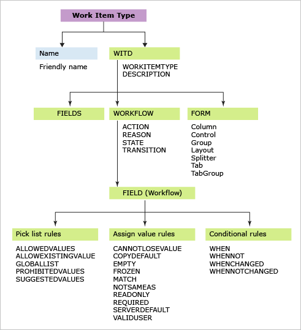
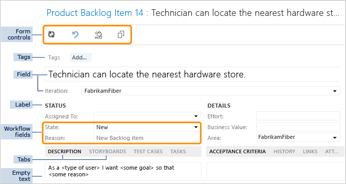
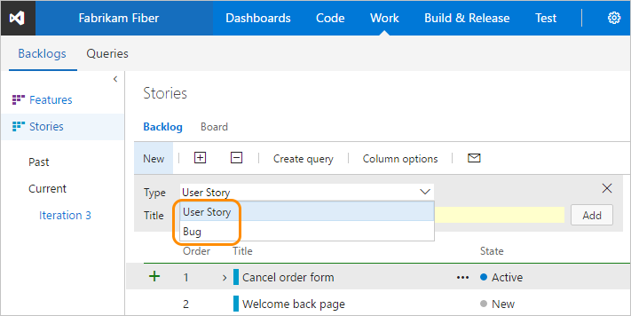
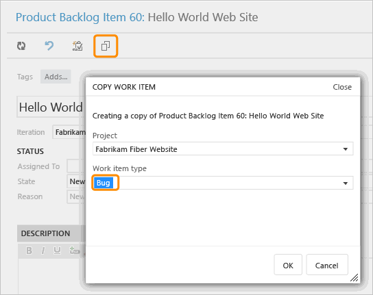

# Add or modify a work item type 

<b>Team Services (Hosted XML) | TFS 2017 | TFS 2015 | TFS 2013</b>

[!INCLUDE [temp](../_shared/customization-phase-0-and-1.md)]

Your team project contains 14 or more work item types (WITs), based on the process&mdash;[Agile](../guidance/agile-process.md), [Scrum](../guidance/scrum-process.md), or [CMMI](../guidance/cmmi-process.md)&mdash;used to create the team project. A WIT is the object you use to [track different types of work](../backlogs/add-work-items.md).  

You can modify an existing WIT or add a custom WIT based on your team's tracking requirements or workflow processes. The most common reasons to modify a WIT are to add or modify the set of fields or field rules, change the workflow, or customize the work item form.   

See [Add or modify a field](add-modify-field.md) if you want to add a custom field or modify the field rules or attributes of an existing field. 

Most WIT customizations are made to the WIT definition, however, other customization are made through the Process Configuration definition or via the **witadmin** command line tool.  

>[!NOTE]  
><b>Feature availability: </b>You can exercise some features only from an on-premises TFS and are noted as such. 

> [!div class="mx-tdBreakAll"]  
> |WIT definition  |ProcessConfiguration definition  |Command line change| 
> |-------------|----------|----------|    
> |- [Add or modify a field to an existing WIT](#modify-field)<br/>- [Add a custom WIT, modify a WIT](#add-wit)<br/>- [Change the workflow (states, reasons, transitions)](#modify-workflow)<br/>- [Modify the work item form](../reference/change-work-item-form-layout.md)  
|- [Specify the WIT color](#change-wit-color) <br/>- [Specify the WIT icon](#change-wit-color) (TFS 2017.2)<br/>- [Specify the workflow state color](#change-wit-color)<br/>- [Add or remove a WIT from the backlog or task board](#change-wit-backlog-board)<br/>- [Add a custom WIT to a backlog or board](add-wits-to-backlogs-and-boards.md)  <br/>- [Add a portfolio backlog ](add-portfolio-backlogs.md)|- [List WITs](../reference/witadmin/witadmin-import-export-manage-wits.md)<br/>- [Deactivate or disable a WIT](#deactivate-wit)<br/>- [Rename a WIT](#rename-wit) (TFS only)<br/>- [Delete a WIT](#delete-wit) (TFS only) |
 

<a id="add-wit">  </a>
<a id="edit-wit">  </a>
<a id="modify-wit">  </a>
## Add or modify a WIT 

To add a custom WIT or modify an existing WIT, you define or modify the XML definition file for the WIT and then import it to your team project [based on the process model you use](../customize/customize-work.md). You modify a WIT by specifying the elements defined within the three main sections of the WIT definition file: **FIELDS**, **WORKFLOW**, and **FORM**.  



The easiest way to add a new WIT is to copy an existing WIT and then modify the definition file. 


<a id="modify-field">  </a>
## Add or modify a field, field rule, label, or empty text  

Any field that you want to use to track data must be added to the WIT definition file. This is true for all but system fields (fields whose reference name start with **System.**). All System fields are defined for all WITs, whether or not you include them in WIT definition. To learn more about each field, see [Work item field index](../guidance/work-item-field.md).

You add fields and field rules to the **FIELDS** section. For the field to appear on the work item form, you must also add it to the **FORM** section of the WIT definition.

For example, to add the work item ID to a form, specify the following XML syntax within the `FORM` section.

    <Control FieldName="System.ID" Type="FieldControl" Label="ID" LabelPosition="Left" />

To learn more about defining fields, see [Add or modify a field](add-modify-field.md).

<a id="modify-workflow">  </a>
## Modify the workflow

**STATES**  and **REASONS** sections within the **WORKFLOW** specify the pick list values in the **State** and **Reason** fields. They track the status of work items. The **TRANSITIONS** section specifies the valid transitions between states, as shown in the following illustration. You specify both forward and regressive transitions.


You change the workflow to accomplish the following objectives:

-   Add or remove a state, reason, or transition  
-   Specify a value for field to be applied during a change in state, reason, or transition  
-   Specify a custom **ACTION** to automate field assignments based on a change in state, reason, or transition.  

When you customize the workflow, follow these two steps:   

1.  [Modify the WORKFLOW of the WIT definition](../reference/change-workflow-wit.md).  

2.  [Modify the process configuration to map new workflow states to metastates](../reference/process-configuration-xml-element.md).  

    This second step is required when you change the workflow for a WIT that appears on an Agile tool page. These WITs belong to either the Requirement or Task categories.   

<a id="workflow-rules">  </a>
### Workflow field rules
You can apply field rules when you change state, specify a reason, or during a workflow transition.

For example, by adding the **EMPTY** rule when the state is set to Active, you can automatically nullify the Closed Date and Closed By fields and make them read-only. This is useful when reactivating a work item from a closed state.

```
<STATE value="Active">
   <FIELDS>
. . .
      <FIELD refname="Microsoft.VSTS.Common.ClosedDate"><EMPTY/></FIELD>
      <FIELD refname="Microsoft.VSTS.Common.ClosedBy"><EMPTY/></FIELD>
   </FIELDS>
</STATE>  
```

Apply workflow field rules to accomplish the following actions:

-   Qualify the value a field can have by specifying **CANNOTLOSEVALUE**, **EMPTY**, **FROZEN**, **NOTSAMEAS**, **READONLY**, and **REQUIRED**  
-   Copy a value into a field by using **COPY**, **DEFAULT**, and **SERVERDEFAULT**  
-   Restrict who can modify a field  
-   Enforce pattern matching on a string field by using **MATCH**  
-   Conditionally apply rules based on values in other fields using **WHEN**, **WHENNOT**, **WHENCHANGED**, and **WHENNOTCHANGED**  
-   Limit rules to apply to specific users or groups. Most rules support the **for** or **not** attributes to focus who the rule does and doesn't apply to.    

For more information about applying workflow field rules, see [FIELD (Workflow) element reference](https://msdn.microsoft.com/library/aa337626.aspx).  

<a id="modify-form">  </a>
## Customize the work item form  

The following illustrations highlight the most common elements on work item forms. You can customize all of them except the title area and form controls. The elements you use to customize the form depend on [whether or not the new form has been enabled by your admin](../customize/manage-new-form-rollout.md).  

**Web form with the new form enabled (Team Services, TFS 2017)**  


 
**Old web form in use (TFS 2015, TFS 2013)**  



You can customize the form to accomplish the following objectives:  


> [!div class="mx-tdBreakAll"]  
> | New form enabled  |Old form in use  |
> |-------------|----------|  
> |- [Add or modify a field](../reference/weblayout-xml-elements.md)<br/>- [Change a field label](../reference/weblayout-xml-elements.md)<br/>- [Rearrange fields](../reference/weblayout-xml-elements.md)<br/>- [Add a group or page](../reference/weblayout-xml-elements.md)<br/>- [Add a group](../reference/weblayout-xml-elements.md)<br/>- [Add a custom control, group, or page](../reference/weblayout-xml-elements.md)<br/>- [Add informational text or hyperlinks](../reference/provide-help-text-hyperlinks-web-content-form.md)<br/>- [Embed HTML text or display dynamic reports](../reference/provide-help-text-hyperlinks-web-content-form.md)  <br/>- [Add a links-control page](../reference/linkscontroloptions-xml-elements.md) |- [Add or modify a field](../reference/specify-work-item-form-controls.md)<br/>- [Change a field label](../reference/specify-work-item-form-controls.md)<br/>- [Rearrange fields](../reference/specify-work-item-form-controls.md)<br/>- [Add tabs, columns, or groups](../reference/design-work-item-form.md)<br/>- [Add informational text or hyperlinks](../reference/provide-help-text-hyperlinks-web-content-form.md)<br/>- [Embed HTML text or display dynamic reports](../reference/provide-help-text-hyperlinks-web-content-form.md)  <br/>- [Add a links-control tab](../reference/define-link-controls.md)<br/>- [Add an attachment control](../reference/add-the-attachments-control.md) |


<a id="change-wit-backlog-board">  </a>
## Add or remove a WIT from the backlog or task board

The Agile planning tools&mdash;product backlog, sprint backlog, and task board pages&mdash;display specific WITs based on the process template used to create your team project. You can add or remove WITs to appear on these pages. For example, if your team project uses Scrum WITs, both product backlog items and bugs appear on the backlog pages. However, if your team project was created using the Agile, CMMI, or other process template, bugs don't appear on your backlog or task board.

For example, you can add bugs from the product backlog page.

[!INCLUDE [temp](../_shared/image-differences.md)]




To learn how to add or remove WITs from the backlog or task board, see [Add a work item type to a backlog and board](add-wits-to-backlogs-and-boards.md). To add a new WIT to support a portfolio backlog, see [Add a portfolio backlog level](add-portfolio-backlogs.md).


<a id="change-wit-color">  </a>
### Change the WIT color, icon, or workflow state color

In the web portal, work items appear in query results and on the backlog and board pages of the Agile tools. To change the color or icon associated with an existing WIT or add the color to use for a new WIT, [edit the process configuration](../reference/process-configuration-xml-element.md#wit-colors). To change the color for a workflow state, you also [edit the process configuration](../reference/process-configuration-xml-element.md#state-colors). 

>[!NOTE]  
>**Feature availability:** <!---For Hosted XML process model, you can customize the WIT color, icon, and workflow state color. -->For On-premises XML, you can customize the workflow state color for TFS 2015.2 or later versions, and you can customize the WIT icon for TFS 2017.2 and later versions.  
 
  

## Related notes

This topic addressed how to add and customize WITs and process configuration for Hosted XML and On-premises XML process models. For information on adding and customizing fields for Hosted XML and On-premises XML process models, see [Add or modify a work item type](add-modify-wit.md). For the Inheritance process model , see [Customize a process](../process/customize-process.md).  

Other related topics or resources: 

- [Guide to administrative tasks](../../accounts/account-management.md)  
- [ProcessConfiguration XML elements](../reference/process-configuration-xml-element.md)
- [**witadmin** command-line tools](../reference/witadmin/witadmin-customize-and-manage-objects-for-tracking-work.md)
- [Customize the work tracking experience](customize-work.md)  
- [Customize cards on boards](customize-cards.md)  
- [Team Foundation Server - Project Management & Work Item forum](http://social.msdn.microsoft.com/Forums/vstudio/home?forum=tfsworkitemtracking)  


### Required permissions

- To list work item types, you must have your **View project-level information** permission for the team project in the collection set to **Allow**.  
- (TFS) To add or customize a WIT, you must be a member of the Project Administrators group or have your **Edit project-level information** permission set to Allow.
- (Team Services)  To add or customize a WIT by customizing a process template, you must be a member of the Project Collection Administrators group or have your **Edit process** permission set to Allow    
  
To get added as an administrator, see [Add administrators](../../accounts/add-administrator-tfs.md).


<a id="witadmin">  </a>  
### Import and export WIT definition files (On-premises XML)

>[!NOTE]  
>If you use the Hosted XML process model, you need to import and export the process template used by your team project. For details, see [Customize the work item tracking web form](customize-wit-form.md).

1.  If you don't have administration permissions for your team project, [get them](../../accounts/add-administrator-tfs.md).  

2.  Open a Command Prompt window where either Visual Studio or Team Explorer is installed and enter:  

        cd %programfiles%\Microsoft Visual Studio 12.0\Common7\IDE  

    On a 64-bit edition of Windows, replace %programfiles% with %programfiles(x86)%. Go [here to download Visual Studio Community](https://go.microsoft.com/fwlink/?LinkId=691978&clcid=0x409) for free.  

3.  Export the WIT definition file where you want to modify or add a field. Specify the name of the WIT and a name for the file.  

        witadmin exportwitd /collection:CollectionURL /p:ProjectName /n:TypeName /f:"DirectoryPath/FileName.xml"  

    An example of a *CollectionURL* is `http://MyServer:8080/tfs/TeamProjectCollectionName`.  

4.  Edit the file. For details, see [Index to XML element definitions](../reference/xml-element-reference.md).  

5.  Import the WIT definition file.  

        witadmin importwitd /collection:CollectionURL /p:ProjectName /f:"DirectoryPath/FileName.xml"  

6.  Open the web portal or refresh the page to view the changes.  

    For more information about using **witadmin**, see [Import, export, and manage work item types](../reference/witadmin/witadmin-import-export-manage-wits.md).


### Enable features after upgrade (On-premises XML) 

>[!NOTE]  
><b>Feature availability: </b>You can exercise the Configure Features Wizard only from an on-premises TFS. 

What customizations can you make and still use the Configure Features Wizard to update my team project after a TFS upgrade?  

You can add custom WITs and change the form layout. The [Configure Features Wizard](configure-features-after-upgrade.md) will update your team projects and you'll get access to the latest features.

Changing the workflow or renaming a WIT might require you to perform some manual operations when updating your team project. To learn about other customizations that you can safely make and which you should avoid, see [Customize the work tracking experience: Before you customize, understand the maintenance and upgrade implications](customize-work.md#before-you-customize).  

### Rename a WIT (On-premises XML) 

>[!NOTE]  
><b>Feature availability: </b>You can exercise **witadmin renamewitd** only from an on-premises TFS. 

To rename an existing WIT use **witadmin renamewitd**. For example, you can rename a WIT labeled "QoS Item" to "Service Agreement."

```
witadmin renamewitd /collection:"http://FabrikamPrime:8080/tfs/DefaultCollection" /p:"Fabrikam Web Site" /n:"QoS Item" /new:"Service Agreement"
```

When you rename a WIT that belongs to a category, you have to update the categories definition for the team project to reflect the new name. In particular, the [backlogs and boards](../backlogs-boards-plans.md) will not work until you update the categories definition.

For more information, see [Import, export, and manage work item types](../reference/witadmin/witadmin-import-export-manage-wits.md) and [Import and export categories](../reference/witadmin/witadmin-import-export-categories.md).

<a id="deactivate-wit">  </a>
### Deactivate or disable a WIT (On-premises XML) 

How do you restrict users from creating work items of a certain type?

If you have a WIT that you want to retire, but maintain the work items that have been created based on that type, you can add a rule that disables all valid users from saving the work item type.

```
<TRANSITION from=" " to="New">
  <FIELDS>
     <FIELD refname="System.CreatedBy">
        <VALIDUSER not="[Team Project Name]Project Valid Users" />
     </FIELD>
  </FIELDS>
</TRANSITION> 
```
If you want to restrict creation of a specific WIT to a group of users, there are two ways to restrict access:

-   [Add the WIT to the Hidden Categories group](../reference/use-categories-to-group-work-item-types.md) to prevent the majority of contributors from creating them. If you want to allow a group of users access, you [can create a hyperlink to a template](../productivity/work-item-template.md) that opens the work item form and share that link with those team members who you do want to create them.

-   Add [a field rule to the workflow](../reference/apply-rule-work-item-field.md) for the System.CreatedBy field to effectively restrict a group of users from creating a work item of a specific type. As the following example shows, the user who creates the work item must belong to the `Allowed Group` in order to save the work item.

        <TRANSITION from=" " to="New">
           <FIELDS>
              <FIELD refname="System.CreatedBy">
                <VALIDUSER for="Allowed Group" not="Disallowed Group" />
              </FIELD>
           </FIELDS>
        </TRANSITION> 

<a id="delete-wit">  </a>
### Delete a WIT (On-premises XML) 

To prevent team members from using a specific WIT to create a work item, you can remove it from the team project. When you use **witadmin destroywitd**, you permanently remove all work items that were created using that WIT as well as the WIT itself. For example, if your team doesn't use "Impediment", you can delete the WIT labeled "Impediment" from the Fabrikam Web Site project.

    witadmin destroywitd /collection:"http://FabrikamPrime:8080/tfs/DefaultCollection" /p:"Fabrikam Web Site" /n:"Impediment" 

When you delete a WIT that belongs to a category, you must update the categories definition for the team project to reflect the new name. For more information, see [Import, export, and manage work item types](../reference/witadmin/witadmin-import-export-manage-wits.md) and [Import and export categories](../reference/witadmin/witadmin-import-export-categories.md).


### How do WIT modifications affect existing work items?

The following table summarizes the effect on existing work items when you modify fields or WIT definitions.

|Action|Effect on existing work items| 
|---|---| 
|Remove fields from a WIT|Data for the removed fields remains in the data store. However, no new data can be added, because you've removed them from the WIT definition.|  
|Rename a field|Data for the renamed fields remains in the data store under the new friendly name.| 
|Delete fields|Data for the deleted fields is removed from the data store.| 
|Rename a WIT|All data remains intact under the new name.| 
|Delete a WIT|All data for work items created as the deleted WIT is permanently removed with no chance for recovery.| 

If you want to completely remove the fields from the data store, use [**witadmin deletefield** command line tool](../reference/witadmin/manage-work-item-fields.md).

### Change the type of an existing work item  

See [Move, change, or delete work items](../backlogs/remove-delete-work-items.md) for the features available to you based on your platform. 

When you connect to TFS, you can't change the work item type for an existing work item, but you can [copy the work item and specify a new type](../backlogs/copy-clone-work-items.md#copy-clone). For instance, you can copy an existing product backlog item and change the type to bug, as shown in the following illustration.

  

Also, if you have several work items with type changes you want to make, you might want to [export them using Excel](../office/bulk-add-modify-work-items-excel.md), and then re-add them as a new type.


### Workflow changes and earlier versions of the Test Manager client

When you change the workflow for the test plan or test suite&mdash;and you work from a Test Manager client provided with Visual Studio 2013.2 or earlier versions&mdash;these WITs became available when you updated your application-tier server to TFS 2013.3. that appears on an Agile planning tool page.

If you encounter an **Application detected an unexpected fault** error when you connect to your team project after you changed the workflow, you can resolve it by mapping the new workflow states to metastates. To resolve this error, see [Import and export process configuration](../reference/witadmin/witadmin-import-export-process-configuration.md).  
