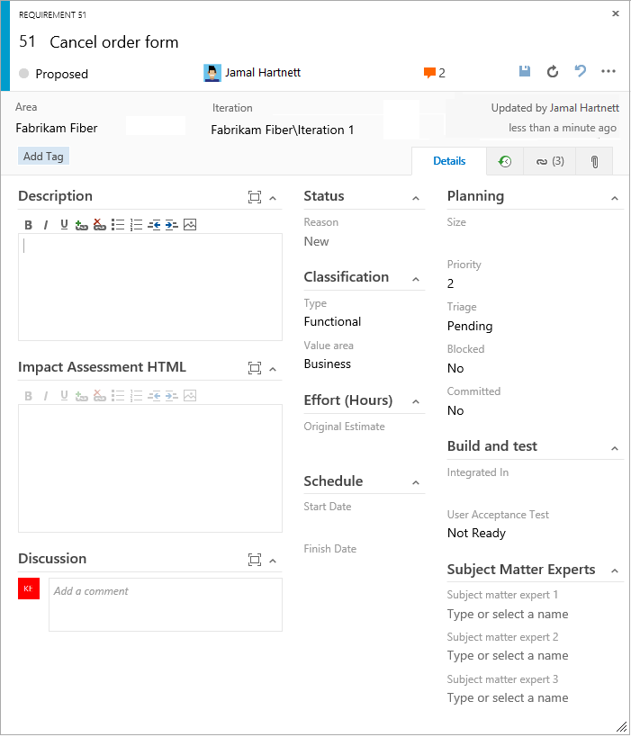
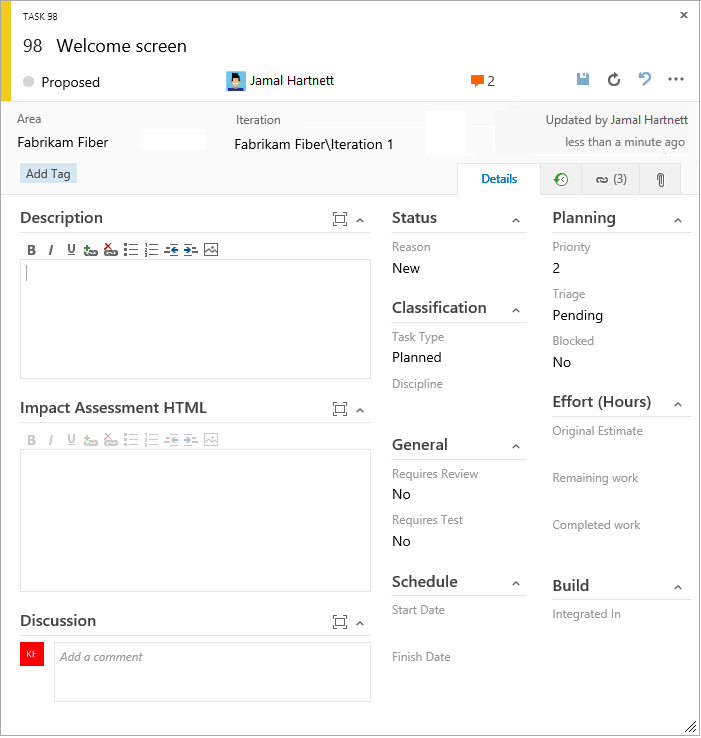
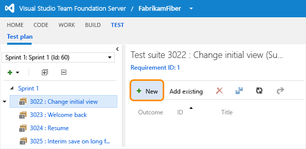
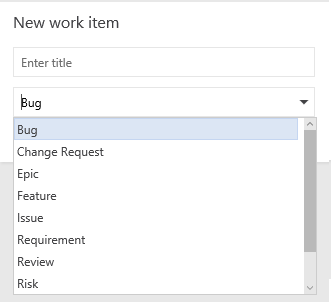

# CMMI process work item types and workflow

<b>Team Services | TFS 2017 | TFS 2015 | TFS 2013</b>

Teams use the work item types (WITs) provided with the MSF for CMMI Process Improvement 2015 (CMMI) process to plan and track progress of software projects. Teams define requirements to manage the backlog of work and then, using the Kanban board, track progress by updating the status of requirements.
 

To gain insight into a portfolio of requirements, product owners can map requirements to features. When teams work in iterations, they define tasks that automatically link to requirements.

Using Microsoft Test Manager and the web portal, testers create and run test cases and define bugs to track code defects.

To support additional CMMI processes, teams can track change requests, risks, issues, and notes captured in review meetings.

>[!NOTE]  
><b>Feature availability: </b> Work item tracking forms and features available to you differ depending on whether you connect to the cloud or an on-premises Team Foundation Server (TFS), and whether you open the form from the web portal or Visual Studio Team Explorer. Forms and guidance provided in this topic reflect those available with the [new form experience](../process/new-work-item-experience.md) (Team Services and the web portal for TFS 2017 and later versions). 
>
>If you connect to TFS 2015 or earlier versions, or open the form from Visual Studio Team Explorer, see [Add work items (TFS)](../backlogs/add-work-items-tfs.md).    

## Define requirements 

Create requirements from the quick add panel on the [product backlog page](../backlogs/create-your-backlog.md). Alternatively, you can bulk add requirements using [Excel](../office//bulk-add-modify-work-items-excel.md) or [Project](../office/create-your-backlog-tasks-using-project.md).

Later, you can open each requirement to provide more details and estimate its size.

  

Requirements specify the functions and product elements that teams need to create. Product owners typically define and stack rank requirements on the product backlog page. The team then scopes the size of the effort to deliver the highest priority items.

Use the following guidance and that provided for [fields used in common across work item types](#definitions-in-common) when filling out the form. For additional guidance, see [Plan a project](cmmi/guidance-plan-a-project-cmmi.md).

<table>
<tbody valign="top">
  <tr>
    <th width="22%">Field</th>
    <th>Usage</th>
  </tr>
  <tr>
    <td>
      

        [Description](../track/titles-ids-descriptions.md)
      

    </td>
    <td>
      
Provide enough detail for estimating how much work will be required to implement the requirement. Focus on who the requirement is for, what users want to accomplish, and why. Don't describe how the requirement should be developed. Do provide sufficient details so that your team can write tasks and test cases to implement the item.

      
In HTML fields, you can add rich text and images. 

      

        
      

    </td>
  </tr>
  <tr>
    <td>
      
[Impact Assessment](cmmi/guidance-requirements-field-reference-cmmi.md)

    </td>
    <td>
      
The customer impact of not implementing this requirement. You might include details from the Kano model about whether this requirement is in the surprise, required, or obvious categories. You capture this information in the rich-text HTML field which corresponds to Impact Assessment.

      

        
      

    </td>
  </tr>
  <tr>
    <td>
      
[Requirement Type](cmmi/guidance-requirements-field-reference-cmmi.md) (Required) 

    </td>
    <td>
      
The kind of requirement to implement. You can specify one of the following values: 

      <ul>
        <li>
          

            <strong>Business Objective </strong>
          

        </li>
        <li>
          

            <strong>Feature</strong> (default)

        </li>
        <li>
          

            <strong>Functional</strong>
          

        </li>
        <li>
          

            <strong>Interface </strong>
          

        </li>
        <li>
          

            <strong>Operational </strong>
          

        </li>
        <li>
          

            <strong>Quality of Service </strong>
          

        </li>
        <li>
          

            <strong>Safety </strong>
          

        </li>
        <li>
          

            <strong>Scenario </strong>
          

        </li>
        <li>
          

            <strong>Security</strong>
          

        </li>
      </ul>
    </td>
  </tr>

<tr>
	<td>
[Value area](../track/planning-ranking-priorities.md)
</td>
	<td>
The area of customer value addressed by the epic, feature, requirement, or backlog item. Values include:

        <ul>
        <li>
          

            <strong>Architectural </strong>: Technical services to implement business features that deliver solution 
          

        </li>
        <li>
          

            <strong>Business</strong>: Services that fulfill customers or stakeholder needs that directly deliver customer value to support the business (Default)
          

        </li>
      </ul>
</td></tr>

  <tr>
    <td>
      

        [Size](../track/query-numeric.md) 

    </td>
    <td>

 

      
Estimate the amount of work required to complete a requirement using any numeric unit of measurement your team prefers. 

 By defining the **Size** for requirements, teams can use the Agile [velocity charts](../../report/guidance/team-velocity.md) and [forecast](../scrum/forecast.md) tools to estimate future iterations or work efforts. The Kanban [Cumulative Flow Diagram](../kanban/kanban-basics.md) references the values in this field. For additional guidance, see the [Estimating](https://msdn.microsoft.com/library/hh765979) white paper.

    </td>
  </tr>
<tr>
	<td>
[Original Estimate](../track/query-numeric.md) 
</td>
	<td>
The amount of estimated work required to complete a task. Typically, this field doesn't change after it is assigned.

You can specify work in hours or in days. There are no inherent time units associated with this field.

</td>
</tr>

<tr>
	<td>
[Start Date/Finish Date](../track/query-by-date-or-current-iteration.md) 
</td>
	<td>
The target dates for when the work will start or finish. These fields are filled in by [Microsoft Project](../office/create-your-backlog-tasks-using-project.md) when you use it for scheduling.

You can specify work in hours or in days. There are no inherent time units associated with this field.

</td>
</tr>

  <tr>
    <td>
      

        [Priority](../track/planning-ranking-priorities.md) (Required)

    </td>
    <td>
      
A subjective rating of the requirement as it relates to the business. Allowed values are:

      <ul>
        <li>
          

            <strong>1</strong>: Product cannot ship without the item.

        </li>
        <li>
          

            <strong>2</strong>: (default) Product cannot ship without the item, but it doesn't have to be addressed immediately. 

        </li>
        <li>
          

            <strong>3</strong>: Implementation of the item is optional based on resources, time, and risk.  

        </li>
      </ul>
      

        
      

    </td>
  </tr>
  <tr>
    <td>
      

       [Triage](../track/planning-ranking-priorities.md) (Required) 

    </td>
    <td>
      
Indicates the type of triage decision that is pending for the work item. Use this field when the work item is in the Proposed state and specify one of the following values: <strong>Pending</strong> (default), <strong>More Info</strong>, <strong>Info Received</strong>, and <strong>Triaged</strong>.

    </td>
  </tr>
  <tr>
    <td>
      

        [Blocked](../track/planning-ranking-priorities.md)

    </td>
    <td>
      
Indicates whether a team member is prevented from making progress toward implementing a requirement or task or resolving a bug, change request, or risk. If an issue has been opened to track a blocking problem, you can create a link to the issue. You can specify <strong>Yes</strong> of <strong>No</strong>.

    </td>
  </tr>
  <tr>
    <td>
      

        [Committed](../track/planning-ranking-priorities.md) (Required)  

    </td>
    <td>
      
Indicates whether the requirement is committed in the project or not. You can specify <strong>Yes</strong> or <strong>No</strong> (default).

    </td>
  </tr>

  <tr>
    <td>
      

        [Integrated In](../track/build-test-integration.md)  

    </td>
    <td>
      
Product build number that incorporates the requirement, change request, or fixes a bug.

    </td>
  </tr>

  <tr>
    <td>
      

        [User Acceptance Test](cmmi/guidance-requirements-field-reference-cmmi.md) (Required) 

    </td>
    <td>
      
The status of the user acceptance test for a requirement. You can specify one of the following values:   

          <ul>
            <li>

  <strong>Pass</strong>

            </li>
            <li>

  <strong>Fail</strong>

            </li>
            <li>

  <strong>Not Ready</strong>  (default)

            </li>
            <li>

  <strong>Ready</strong>

            </li>
            <li>

  <strong>Skipped</strong>

            </li>
            <li>

  <strong>Info Received</strong>

            </li>
          </ul>
	
You specify Not Ready when the requirement is in the Active state, and you specify Ready when the requirement is in the Resolved state.

    </td>
  </tr>

  <tr>
    <td>
      

        [Subject Matter Experts](cmmi/guidance-requirements-field-reference-cmmi.md) 
      

    </td>
    <td>
          
The names of team members who are familiar with the customer area that this requirement represents.

    </td>
  </tr>
</tbody>
</table>

>[!TIP]    
>Use the [Discussion section](../backlogs/add-work-items.md#discussion) to add and review comments made about the work being performed. This feature is only available from Team Services.   

## Track progress

As work progresses, you change the State field to update the status. Optionally, you can specify a reason. The state and reason fields appear on the work item form in the header area. 

 

### CMMI workflow states 

These diagrams show the main progression and regression states for the Requirement, Bug, and Task WITs. 

Requirement

Bug

Task

The typical workflow progression for a requirement is:  
-   The product owner creates a requirement in the **Proposed** state with the default reason, **New requirement**.  
-   The product owner updates the status to **Active** when they begin work to implement it.  
-   The team updates the status to **Resolved** when code development is finished and system tests have passed.  
-   Lastly, the team or product owner moves the requirement to **Closed** when the product owner agrees that it has been implemented according to the Acceptance Criteria and passed all validation tests.  

### Update status with Kanban or task boards

Teams can use the [Kanban board](../kanban/kanban-basics.md) to update the status of requirements, and the [sprint task board](../scrum/task-board.md) to update the status of tasks. Dragging items to a new state column updates both the State and Reason fields.

You can customize the Kanban board to support additional [swim lanes](../kanban/expedite-work.md) or [columns](../kanban/add-columns.md). For additional customization options, see [Customize your work tracking experience](#customize-work-tracking).

## Map requirements to features

hen you manage a suite of products or user experiences, you might want to view the scope and progress of work across the product portfolio. You can do this by [defining features](../backlogs/define-features-epics.md) and [mapping requirements to features](../backlogs/organize-backlog.md).

Using portfolio backlogs, you can [drill down from one backlog to another](../scale/portfolio-management.md) to view the level of detail you want. Also, you can use portfolio backlogs to view a rollup of work in progress across several teams when you [setup a hierarchy of teams](../scale/multiple-teams.md).

The feature work item contains similar fields provided for requirements and includes additional fields, as the following table describes.

## Define tasks

When your team manages their work in sprints, they can use the [sprint backlog page](../scrum/sprint-planning.md) to break down the work to be accomplished into distinct tasks.  

Name the task and estimate the work it will take.

When teams estimate work they define tasks and estimate the hours or days to complete tasks. Teams forecast work and define tasks at the start of an iteration, and each team member performs a subset of those tasks. Tasks can include development, testing, and other kinds of work. For example, a developer can define tasks to implement requirements, and a tester can define tasks to write and run test cases. By linking tasks to requirements and bugs, they see the progress made on these items. For additional guidance, see [Iteration activities](cmmi/guidance-iteration-activities.md).

<table>
<thead>
<tr>
<th>
Field
</th>
<th>
Usage
</th>
</tr>
</thead>
<tbody valign="top">
<tr>
<td>
[Task Type](cmmi/guidance-requirements-field-reference-cmmi.md) 
</td>
<td>
Select the kind of task to implement from the allowed values:

<ul>
<li>
<strong>Corrective Action</strong>
</li>
<li>
<strong>Mitigation Action</strong>
</li>
<li>
<strong>Planned</strong>
</li>
</ul></td>
</tr>
<tr>
<td>
[Discipline](../track/query-numeric.md)
</td>
<td>
Select the discipline this task represents when your team estimates sprint capacity by activity.

<ul>
<li>
<strong>Analysis</strong>
</li>
<li>
<strong>Development</strong>
</li>
<li>
<strong>Test</strong>
</li>
<li>
<strong>User Education</strong>
</li>
<li>
<strong>User Experience</strong>
</li>
</ul>

This field is also used to calculate capacity by discipline. It is assigned to `type=&quot;Activity&quot;` in the ProcessConfiguration file. (2)

For additional guidance, see [Implement development tasks](cmmi/guidance-implement-development-tasks.md).
</td>
</tr>
<tr>
<td>
[Original Estimate](../track/query-numeric.md) 
</td>
<td>
The amount of estimated work required to complete a task. Typically, this field doesn't change after it is assigned.
</td>
</tr>
<tr>
<td>
[Remaining Work](../track/query-numeric.md)
</td>
<td>
Indicate how many hours or days of work remain to complete a task. As work progresses, update this field. It's used to calculate capacity charts, the sprint burndown chart, and the [Burndown and Burn Rate Report](https://msdn.microsoft.com/library/dd380678.aspx).

If you divide a task into subtasks, specify hours for the subtasks only. You can specify work in any unit of measurement your team chooses.

The amount of work remaining to complete a task. As work progresses, update this field. It's used to calculate [capacity charts](../scale/capacity-planning.md), the [sprint burndown chart](../scrum/sprint-burndown.md), and the [Sprint Burndown](https://msdn.microsoft.com/library/ff731588.aspx) report. 

If you divide a task into subtasks, specify hours for the subtasks only. You can specify work in any unit of measurement your team chooses.

</td>
</tr>
<tr>
<td>
[Completed Work](../track/query-numeric.md)
</td>
<td>
The amount of work that has been spent implementing a task.
</td>
</tr>
</tbody>
</table>

## Track test progress 

### Test requirements

From the web portal or Test Manager, you can [create test cases that automatically link to a requirement or bug](../../test/manual-exploratory-testing/getting-started/create-test-cases.md).  Or, you can link a requirement to a test case from the  (links tab). 

  

The test case contains a number of fields, many of which are automated and integrated with Test Manager and the build process. For a description of each field, see [Query based on build and test integration fields](../track/build-test-integration.md).  

The  (links tab) lists all the requirements and bugs in a test case. By using linking, the team can track the progress made in testing each item and supports information that appears in the [Requirements Overview Report](../../report/sql-reports/requirements-overview-report-cmmi.md) report.

### Track code defects

You can [create bugs from the web portal web portal, Visual Studio, or when testing with Test Manager](../backlogs/manage-bugs.md). 

## Track change requests, risks, issues, and notes captured in review meetings

In addition to the requirement, feature, task, and bug WITs, you can track information recommended by the CMMI process with the following WITS.

-  [Change request](cmmi/guidance-change-request-field-reference-cmmi.md) to [manage proposed changes](cmmi/guidance-manage-change.md) to any work product that is under change control.  
-   [Issue](cmmi/guidance-bugs-issues-risks-field-reference-cmmi.md) to track an event or situation that might block work or is blocking work on the product. [Issues differ from risks](cmmi/guidance-manage-issues-cmmi.md) in that teams identify issues spontaneously, generally during daily team meetings. 
-   [Risk](cmmi/guidance-bugs-issues-risks-field-reference-cmmi.md) to track the probability  and degree of variance between actual and desired outcomes. When you [manage risks](cmmi/guidance-manage-risks.md), you strategically minimize the variance between the outcome that you want and the actual outcome.  
-   [Review](cmmi/guidance-review-meeting-field-reference-cmmi.md) to document the results of a design or code review. Team members can [capture the details of how the design or code meets standards](cmmi/guidance-implement-development-tasks.md) in areas of name correctness, code relevance, extensibility, code complexity, algorithmic complexity, and code security.  
 
You can add an issue from the  [New work item widget](../../Report/widget-catalog.md#new-work-item-widget) added to a [team dashboard](../../Report/dashboards.md), or from the **New** menu on the Queries page. 

  

Work items you add from the widget are automatically scoped to your [team's default area and iteration paths](../scale/set-team-defaults.md). To change the team context, see [Switch team context](#team-context).  

[!INCLUDE [temp](../_shared/common-work-item-fields.md)]   

## Related notes 

[!INCLUDE [temp](../_shared/create-team-project-links.md)]  

[!INCLUDE [temp](../_shared/customize-work-tracking.md)]   

### Backlog list order

The [Stack Rank](../track/planning-ranking-priorities.md) field is used to track the relative ranking of requirements, features, or epics. However, by default it doesn't appear on the work item form. The sequence of items on the backlog page is determined according to where you have [added the items or moved the items on the page](../backlogs/create-your-backlog.md#move-items-priority-order). As you drag items, a background process updates this field.  

This field doesn't appear on the work item form. 

[!INCLUDE [temp](../_shared/switch-team-context-work.md)]  
  

### Links control, client work item form 

Work item forms displayed in a client and the web portal for TFS 2015 and earlier versions display link tabs and link control restrictions as described in the following table. 

<table>
<thead>
<tr>
<th>
Tab name
</th>
<th>
Work item type
</th>
<th>
Link restrictions
</th>
</tr>
</thead>
<tbody valign="top">
<tr>
<td>
<strong>All Links</strong>
</td>
<td>
Requirement

Bug

Change Request

Feedback Request

Issue

Review

Risk

Shared Steps

Task

Test Case
</td>
<td><ul>
<li>
No restrictions.
</li>
</ul></td>
</tr>
<tr>
<td>
<strong>Implementation</strong>
</td>
<td>
Task
</td>
<td><ul>
<li>
Allows only <strong>Parent</strong> and <strong>Child</strong> links between requirements and tasks.
</li>
<li>
Excludes links to work items in other team projects.
</li>
</ul></td>
</tr>
<tr>
<td>
<strong>Links</strong>
</td>
<td>
Code Review Request
</td>
<td><ul>
<li>
Allows only <strong>Parent</strong> and <strong>Child</strong> links to Code Review Response work items.
</li>
<li>
Excludes links to work items in other team projects.
</li>
</ul></td>
</tr>
<tr>
<td>
<strong>Requirements</strong>
</td>
<td>
Change Request
</td>
<td><ul>
<li>
Allows only <strong>Affects</strong> link type to link change requests to requirements.
</li>
<li>
Excludes links to work items in other team projects.
</li>
</ul></td>
</tr>
<tr>
<td>
<strong>Stories</strong>
</td>
<td>
Feedback Response
</td>
<td><ul>
<li>
Allows only <strong>Related</strong> links to requirements.
</li>
<li>
Excludes links to work items in other team projects.
</li>
</ul></td>
</tr>
<tr>
<td>
<strong>Storyboards</strong>
</td>
<td>
Requirement
</td>
<td><ul>
<li>
Allows only <strong>Storyboard</strong> links.
</li>
</ul></td>
</tr>
<tr>
<td>
<strong>Test Cases</strong>
</td>
<td>
Requirement

Bug
</td>
<td><ul>
<li>
Allows only <strong>Tested By</strong> links.
</li>
<li>
Allows links only to test cases.
</li>
<li>
Excludes links to work items in other team projects.
</li>
</ul></td>
</tr>
<tr>
<td>
<strong>Tested Requirements</strong>
</td>
<td>
Test case
</td>
<td><ul>
<li>
Allows only <strong>Tests</strong> links.
</li>
<li>
Allows links only to requirements.
</li>
<li>
Excludes links to work items in other team projects.
</li>
</ul></td>
</tr>
</tbody>
</table>

[!INCLUDE [temp](../_shared/help-support-shared.md)]