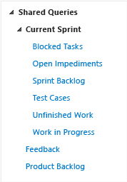
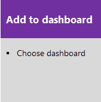

# Scrum process   

[!INCLUDE [temp](../_shared/version-vsts-tfs-all-versions.md)]

The Scrum process supports the following work item types (WITs) to plan and track work, tests, feedback, and code review. With different WITs you can track different types of work&mdash;such as product backlog items, tasks, bugs, and more. These artifacts are created when you create a team project using the Scrum process. They are based on [Scrum principles and values](https://www.scrum.org/). 

  

In addition to the WITs, teams have access to a set of shared work item queries to track information, analyze progress, and make decisions. If you work from an on-premises TFS, you also have access to additional [SQL Server reports](#reports) and [SharePoint dashboards](#dashboards).  

>[!NOTE]  
><b>Feature availability:</b> From the cloud-based VSTS, you'll always have access to the latest version of the Scrum process, [which you can also customize](../process/customize-process.md). If you connect to an on-premises Team Foundation Server (TFS), the latest version of the Scrum process uploads automatically when you install or upgrade to the latest version of TFS. You can [customize team projects](../customize/customize-work.md) and use the [Process Template Manager](manage-process-templates.md) to upload and download process templates. 
>
>The following WITs are available as follows: Epic, TFS 2015 and later versions; 
>Shared Parameters, TFS 2013.2 and later versions; 
>and Test Plan and Test Suite, TFS 2013.3 and later versions.   
>
>Additional artifacts, such as [SQL Server reports](#reports) and [SharePoint dashboards](#dashboards), are only available when you connect to a team project from an on-premises Team Foundation Server (TFS). Other resource requirements apply. 

In addition to WITs, reports, and dashboards, teams have access to a set of shared work item queries to track information, analyze progress, and make decisions. 

## Plan and track work with Scrum  

You build your project plan by creating a backlog of work items that represent the features, requirements, user stories, or other work to perform. You track bugs, tasks, and blocking issues using the bug, task, and impediment WITs. To support portfolio management, teams create features and epics to view a roll up of their product backlog items within or across teams. For details about using Scrum WITs, see [Scrum process work item types and workflow](scrum-process-workflow.md).  

The essential flow for getting started is as shown. To get started using Scrum or Kanban tools, see [Get started with Agile tools to plan and track work](../overview.md).  

> [!NOTE]  
> A work item is a database record that contains the definition, assignment, priority, and state of work. Work item types define the template of fields, workflow, and form for each type. Work items can be linked to each other to support tracking dependencies, roll up of work, and reports.  
  

[Scrum work item types and workflow](scrum-process-workflow.md) provides more details about using these WITs.  

 
###List work items

To list work items for a current sprint or the product backlog, use the shared queries that the Scrum process provides.  

  

[Descriptions of predefined queries](#predefined-queries) are listed later in this topic.   

You can open a query from the work items page and then use the [query editor to apply different filter criteria](../track/using-queries.md). Also, you can [add queries to team dashboards](../../report/dashboards.md). From Team Explorer, you can open any [work item query in Excel](../office/bulk-add-modify-work-items-excel.md) to  perform bulk edits.  

<blockquote style="font-size: 13px"><b>Tip: </b>Queries listed under the Current Iteration folder do not automatically update when a new iteration becomes current. The current iteration is based on the dates that you [assign to your sprint schedules](../scrum/define-sprints.md). You must manually update the iteration path of each query to have it point to the iteration path that corresponds to the current iteration. Or, you can edit the shared query to [use the **@CurrentIteration** macro](../track/query-by-date-or-current-iteration.md). </blockquote>  

[!INCLUDE [temp](../_shared/quick-tips-shared-query.md)] 

## Monitor progress  

All processes&mdash;Agile, Scrum, and CMMI&mdash;support [building status and trend charts and dashboards](../../report/overview.md). In addition, several charts are automatically built based on the Agile tools you use. These charts display within the web portal. 

### Scrum process and light-weight charts  
To get started, you can open a shared query and create a chart based on your tracking interests. Chart types include status&mdash;pie, bar, column, stacked bar, and pivot&mdash;and trend&mdash;stacked area, line, and area&mdash;charts.   

  

[!INCLUDE [temp](../_shared/powerbi-reports-links.md)] 

###Scrum process and SQL Server reports (TFS) 

If you connect to an on-premises TFS, you can access the following Scrum process reports. For these reports to be useful, [teams must perform certain activities,](../../report/admin/review-team-activities-for-useful-reports.md) such as define build processes, link work items, and update status or remaining work.  

To access these reports, your team project collection and the team project must be configured with SQL Server Analysis Services and Reporting Services.  If you need to add reporting services or update reports to the latest versions, see [Add reports to a team project](../../report/admin/add-reports-to-a-team-project.md).  

### SharePoint portal dashboards (TFS) 

If you connect to an on-premises TFS, you can access the [Release](../../report/sharepoint-dashboards/release-scrum.md) dashboard displayed through the SharePoint project portal. This dashboard displays project data, support investigation tasks, and help teams to perform common tasks quickly. 

To access this dashboard, your team project must have a [project portal configured and the project portal must point to a SharePoint site](../../report/sharepoint-dashboards/configure-or-add-a-project-portal.md).

## Related notes 

[!INCLUDE [temp](../_shared/create-team-project-links.md)]

<a id="predefined-queries" />
### Scrum process predefined queries

Your product owner can plan and track product backlog items and bugs in the product backlog by using the **Product Backlog** query. You can find work items that are assigned to the current sprint by using the shared queries that are listed under the **Current Sprint** folder. These queries find work items that are assigned to a specified iteration or sprint. As you plan additional sprints, you can modify these queries to specify the latest sprint and save them to additional folders that you create, such as **Sprint 2** or **Sprint 3**.

The project administrator for each team project [defines area paths](../customize/set-area-paths.md) and [iteration paths](../customize/set-iteration-paths-sprints.md) for that project so that the team can track progress by those designations.  

|Shared queries|Description| 
|---|---|  
|Blocked Tasks | Lists all tasks in the current sprint that have been marked as Blocked.|
|Open Impediments |Lists all open impediment work items in the current sprint.|
|Sprint Backlog |Lists all product backlog items, bugs, and their linked tasks that your team has committed to complete in the current sprint.|
|Test Cases |Lists all test cases in the current sprint and sorts them by priority.|
|Unfinished Work |Lists all product backlog items, bugs, and their linked tasks that have not been marked as Done in the current sprint.|
|Work in Progress |Lists all tasks in the current sprint that are marked as In Progress.| 
|Feedback | Lists all feedback responses that are in an Active state. |
|Product Backlog |Lists all product backlog items and bugs that are assigned to the root iteration. Product backlog items and bugs are sorted by backlog priority.|  

