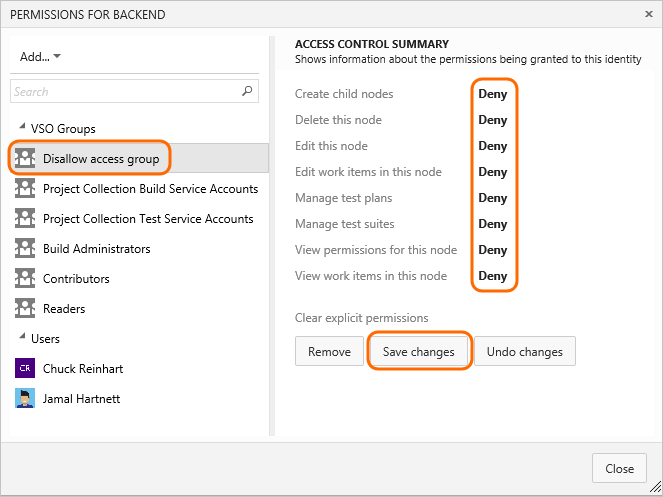

# Set permissions and access for work tracking   

<b>Team Services | TFS 2017 | TFS 2015 | TFS 2013</b> 

You can grant or restrict access to various work tracking features. You do this by granting users or groups specific permissions for the team project or at the object-level. 

**Project-level permissions**
- Restrict ability to create work item tags  
- Restrict ability to delete and restore work items  
- Restrict ability to move work items out of a team project
- Grant ability to permanently delete work items
- Customize a team project
	- Create and modify work item types, link types, categories, and process configuration
	- Add teams and team administrators 
	- Edit project level permissions 

**Object-level permissions**
- Restrict access to view or modify work items under an area path 
- Grant access to define or modify queries or query folders 
- Grant access to create and manage area paths or iteration paths 

**Role-based permissions**
- Add a user as a team administrator to allow them to configure team settings 

Add users to the Contributors group to provide access to most features as listed in [Permissions and access for work tracking](../permissions-access-work-tracking.md) 

 

## Set permissions to restrict access to work items   

Permissions placed on an area paths allows you to permit or restrict access to edit or modify work items, test cases, or test plans assigned to those areas. You can restrict access to users or groups. You can also set permissions for who can add or modify areas or iterations for the team project.  

1. Open the **Security** dialog for the node you want to manage.  

	

2. Select the group or team member, and then change the permission settings. For example, for the Disallow Access Group, deny the ability to view, modify, or edit work items in the FabrikamFiber area path.

	

	If the group or team member doesn't appear in the list, you can [**Add** it](../../accounts/add-users.md).  
	
You can specify two explicit authorization states for permissions: **Deny** and **Allow**. In addition, permissions can exist in one of three additional states.  

| Permission 		| Authorization |
| ----------------- | ------------- |
| Allow 			| Explicitly grants users to perform the task associated with the specific permission. For users to access a task, the associated permission must be set to **Allow** or **Inherited allow**. |
| Deny 				| Explicitly prevents users from performing the task associated with the specific permission. **Deny** takes precedence over **Allow**.  For exceptions to these rules, see [Permissions reference](../../security/about-permissions.md#inheritance)|
| Inherited allow/Inherited deny 	| Allows or denies a user to perform the task associated with the permission based on the permission set for a group to which the user belongs. |
| Not set         	| Implicitly prevents users from performing the action associated with the permission.  Because the permission is neither explicitly set to **Deny** nor explicitly set to **Allow**, authorization for that permission can be inherited from other groups of which the user or group is a member.  By default, most permissions are not set to either **Deny** or **Allow**, the permissions are left **Not set**.  |

For additional ways to restrict modifications to work items, see [Restrict who can create or modify a work item](../reference/apply-rule-work-item-field.md). 

###Set permissions to delete work items   

By default, Project Administrators and Contributors can change the work item type and delete work items by moving them to the Recycle bin. Only Project Administrators can permanently delete work items and test artifacts. Project admins can grant permissions to other team members as needed. 

For example, as a project admin you can grant a user, team group, or other group you've created to have these permissions. Open the Security page for the team project and choose the user or group you want to grant permissions. (To learn how to access the admin pages, see [Work in the web portal](../../connect/work-web-portal.md).)

In this example, we grant the Team Admins group permissions to move work items to another team project and to permanently delete work items.     

###Restrict users from deleting work items 
You can restrict users from deleting work items by changing their permissions to Delete work items in this project. For more information about restricting permissions, see [Restrict access to resources, Work items](../../accounts/restrict-access-tfs.md#work-items). 

###Additional permissions and access level required to delete test artifacts
  
In addition to the project-level permissions set in the previous section, team members need permissions to manage test artifacts which are set for an area path. 

Open the Security page for the area path and choose the user or group you want to grant permissions.

Set the permissions for **Manage test plans** and **Manage test suites** to **Allow**.  

To have full access to the Test feature set, your [access level must be set to Advanced](../../security/change-access-levels.md). Users with Basic access and with permissions to permanently delete work items and manage test artifacts can only delete orphaned test cases. 

## Related notes 

*	[Permissions and access for work tracking](../permissions-access-work-tracking.md) 
   
