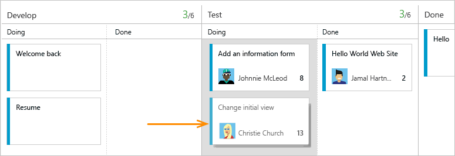
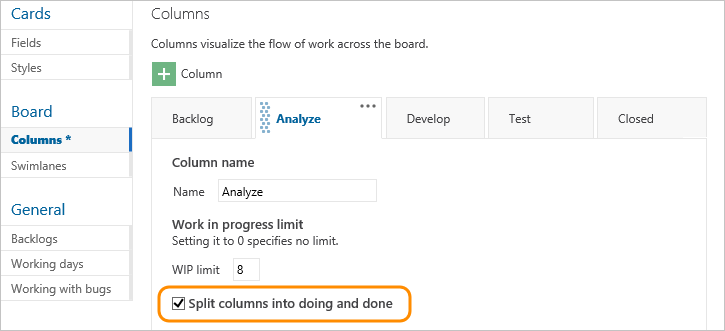
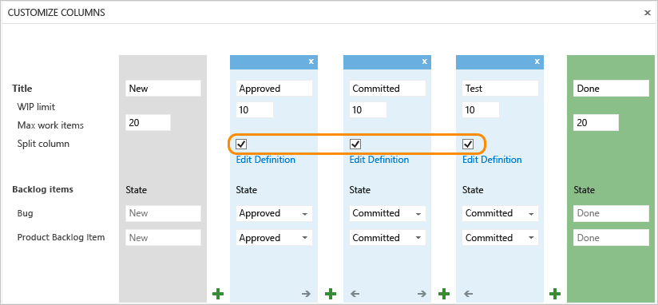

# Split columns

<b>VSTS | TFS 2017 | TFS 2015 </b>

You use your Kanban board to visualize the flow of work, and monitor how items are or aren't progressing. Because each column corresponds to a stage of work, you can quickly see the number of items in progress at any each stage.  

However, a lag often exists between when work gets moved into a column and when work actually starts. To counter that lag and reveal the actual state of work in progress, you can turn on split columns.  

When split, each column contains two sub-columns, Doing and Done.

 
  

Split columns lets your team to implement a pull model. Without split columns, teams push work forward, to signal that they've completed their stage of work. However, pushing it to the next stage doesn't necessarily mean that a team member immediately starts work on that item.  

By contrast, with split columns, your team knows exactly how many items sit idle, waiting for work to begin. You now have greater visibility into the quantity of items that sit idle at each stage throughout your workflow process. 

##Push items into Done, pull items into Doing 

With split columns turned on, you update status of items on the Kanban board in the same way you have before. However, now when you've completed work on an item, you move it into Done, instead of a downstream column. When the next team member becomes free to work on the next high priority item, she pulls it into Doing and reassigns it to herself.  

For example, as a team member completes his coding task, he moves the item into Done under the Develop column. When the tester is ready to test the item, she pulls it into Doing under the Test column.  

If you're new to Kanban, review [Kanban basics](kanban-basics.md)  to get an overview of how to access your board and implement Kanban.

##Identify bottlenecks, drive toward a perfect flow scenario
How can you use split columns to improve workflow?  

Split columns provides you even greater insight into how many items sit idle in a Done column. Your team can readily see when items pile up, which signal a potential bottleneck.   

  

By reviewing the frequency of pile ups and where they occur, your team can adjust their processes to eliminate the bottlenecks. Workflow processes that incur no or very few bottlenecks correspond to perfect flows. No item sits in a queue for any substantial period of time.  

##Choose which columns you want to split  
Now that you understand how your team can use split columns, here's how to turn them on.

1. From your Kanban board, click  and as needed, click Columns.  

	
	
	Go to [Kanban basics](kanban-basics.md) to learn how to access your Kanban board. And, if you aren't a team admin, [get added as one](../scale/add-team-administrator.md). Only team and project admins can customize columns.  

	You'll see different column titles and choices based on the following:
	
	- You connect to VSTS or an on-premises TFS  
	- The [Process](../guidance/choose-process.md) you used to create your team project  
	- Whether your team has chosen to [treat bugs like requirements or like tasks](../customize/show-bugs-on-backlog.md)  

2.	Select each column that you want to split. Before you split columns, you'll want to have [mapped each stage of your team's process to a Kanban column](add-columns.md). 

	**VSTS:**  Click the column tab that you want to set.   

	  

	<blockquote><b>Note:</b> When you connect to VSTS, you can can filter queries and create charts using the [Board Column Done field](../track/query-by-workflow-changes.md#kanban_query_fields).</blockquote>  

	**On-premises TFS options:**   

	  

	Only split columns where clear hand-offs exist and you want teams to pull the item into the next stage.  

##Related Kanban notes  
For more ways to implement Kanban and customize your board:  

* [Add columns](add-columns.md)  
* [Work in Progress limits ](wip-limits.md)  
* [Add swimlanes, expedite work](expedite-work.md)   
* [Definition of Done](definition-of-done.md)  
* [Customize cards](../customize/customize-cards.md)   

