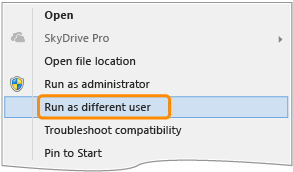

# TF31003: Your user account does not have permission to connect to the Team Foundation Server {0}

[!INCLUDE [temp](../../_shared/dev15-version-header.md)]

You might receive this error when you try to connect to Visual Studio Team Services (Team Services) or an on-premises Team Foundation Server (TFS).  
  
|Problem|Resolution|  
|-------------|----------------|  
|You can't switch between different organizational accounts.|If you work with several Team Services accounts that connect to different directories, such as accounts that are created from the Microsoft Azure Preview Portal, the sign-out function might not work as expected. For example, you can't switch between different organizational accounts to connect to multiple accounts that are linked to directory tenants.   When this problem occurs, you see a flashing blank sign in dialog box several times. Then, you receive either TF31002 or TF31003 error after you connect to or add a new connection in "Connect to Team Foundation Server" dialog box.   To resolve this problem, apply the most recent [Visual Studio update](http://www.visualstudio.com/downloads).   To learn more, see [KB Article ID 2958966](http://support.microsoft.com/kb/2958966).|  
|You have multiple Microsoft accounts that you use to connect to VSTS. You may have used another account for one purpose and it was cached.|To run Visual Studio under an account that is different from your logged on Windows account, open the context menu for `devenv.exe` to access your run as options.         The executable is in this folder: *Drive*:\Program Files (x86)\Microsoft Visual Studio 12.0\Common7\IDE\\.|  
|Your web browser has cached a cookie based on old, different, or out of date credentials.|Try clearing the cookies for your browser, or try logging off your client computer or workstation and logging back on.|  
|Your password in Active Directory or [Azure Active Directory](http://azure.microsoft.com/services/active-directory) has expired.|Verify that your password is active.   If you didn't log off after your password expired, you might still be able to use your account on your machine, but not authenticate with other systems. Try changing your password.   Or, if you recently changed your password, but still have some service using your old credentials, it might be causing your account to lock for some period of time. Try logging off your client computer and logging back on.|  
|Your user account doesn't have sufficient permissions to connect.|Check with your Team Services account administrator or TFS administrator or that you have the necessary permissions to connect. For Team Services, you must have an active, valid license. See [Assign licenses to users of Team Services](../../../accounts/add-account-users-assign-access-levels.md) for details.|  
  
## Related notes 
- [Add users to team projects (TFS)](../../../accounts/add-users.md)   
- [Assign licenses to users of Team Services](../../../accounts/add-account-users-assign-access-levels.md)
- [Permission reference](../../../security/permissions.md)