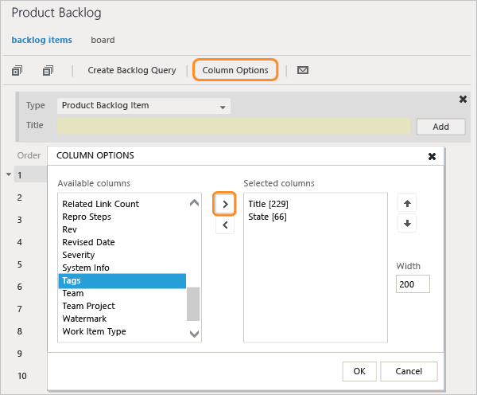

# Add tags to work items to categorize and filter lists and boards  
 

<b>Team Services | TFS 2017 | TFS 2015 | TFS 2013</b>  

Tagging work items helps you quickly filter the product backlog or a work 
item query by categories that you define. 
A tag corresponds to a one or two keyword phrase that you define and that  
supports your needs to filter a backlog or query, or define a query. 

You can add and modify tags from the web portal, from Team Explorer plug-in for Visual Studio. Also, you can open a query in [Excel](../office/bulk-add-modify-work-items-excel.md) to perform bulk modifications of tags.  


>[!NOTE]  
><b>Feature availability: </b>Some features are only available from the web portal or a Team Foundation client such as Visual Studio or the Eclipse plug-in, Team Explorer Everywhere (TEE).  


<table width="100%" >
<tr valign="bottom">
<th width="27%">Task  
</th>
<th width="12%">Team Services
</th>
<th width="12%"><br/>TFS 2015<br/>Web portal  
</th>
<th width="12%">TFS 2015.1<br/>Web portal 
</th>
<th width="12%">TFS 2017<br/>Web portal 
</th>
<th width="16%">Visual Studio &<br/>Eclipse plug-in <sup>1</sup>   
</th>
<th width="7%">Excel <sup>2</sup> 
</th>
</tr>

<tr>
<td>[Add and assign tags](#assign)   
</td>
<td>   
</td>
<td>   
</td>
<td>   
</td>
<td>   
</td>
<td>   
</td>
<td>   
</td>

</tr>

<tr>
<td>[Bulk add or remove tags](#bulk-modify)   
</td>
<td>   
</td>
<td>     
</td>
<td>    
</td>
<td>   
</td>
<td>   
</td>
<td>   
</td>

</tr>


<tr>
<td>[Query based on tags](#query)    
</td>
<td>   
</td>
<td>   
</td>
<td>   
</td>
<td>   
</td>
<td>   
</td>
<td>   
</td>

</tr>


<tr>
<td>[Show tags in your backlogs or query results](#show-tags)   
</td>
<td>   
</td>
<td>   
</td>
<td>   
</td>
<td>   
</td>
<td>   
</td>
<td>   
</td>

</tr>


<tr>
<td>[Filter lists or query results](#filter)  
</td>
<td>   
</td>
<td>   
</td>
<td>   
</td>
<td>   
</td>
<td>   
</td>
<td>   
</td>

</tr>


<tr>
<td>[Filter the Kanban board](../kanban/filter-kanban-board.md)   
</td>
<td>   
</td>
<td>  
</td>
<td>   
</td>
<td>   
</td>
<td>   
</td>
<td> 
</td>

</tr>

<tr>
<td>[Update work items ](#assign)   
</td>
<td>   
</td>
<td>   
</td>
<td>   
</td>
<td>   
</td>
<td>   
</td>
<td>   
</td>

</tr>

 
<tr>
<td>Sort query results using tags   
</td>
<td>   
</td>
<td>   
</td>
<td>   
</td>
<td>  
</td>
<td>   
</td>
<td>   
</td>

</tr>

</table> 

1. Team Explorer Everywhere is the Eclipse plug-in which supports connection to Team Services or TFS. See [Visual Studio Team Explorer Everywhere (TEE)](https://java.visualstudio.com/Docs/tools/eclipse).
2. Requires the TFS Office Integration add-in. See [Bulk add or modify work items with Excel](../office/bulk-add-modify-work-items-excel.md) for details.


By default, all Contributors are granted permissions to create and modify tags.  


<a id="assign"></a>
## Add and assign tags   

1. From the web portal, open a work item and add a tag. Click Add and type your keyword. Or, select from the list of previously assigned tags.  

	  

2. To add several tags at one time, type a comma between tags. Tags are case sensitive.  

	Tags that appear in the tag bar are already assigned to the work item. To unassign a tag, simply choose the x on the tag,.   


<a id="bulk-modify"></a>
##Bulk add or remove tags 

You can bulk update work items to add or remove tags.

>[!NOTE]  
><b>Feature availability: </b>The bulk modify tags feature from the web portal is available from Team Services and TFS 2017 or later versions.   

- When connecting to Team Services or TFS 2017: Bulk modify tags in the same way as you [bulk modify other fields using the web portal](../backlogs/bulk-modify-work-items.md#tags), or use [Excel](../office/bulk-add-modify-work-items-excel.md).  

	  

- When connecting to TFS 2015 or earlier versions: [Use Excel to bulk modify tags](../office/bulk-add-modify-work-items-excel.md).

Bulk modify of tags from the Visual Studio client isn't supported. 

<a id="query"></a>
##Query for work items based on tags  


>[!NOTE]  
><b>Feature availability: </b>To add tags to a query clause, you must work from Team Services or TFS 2013.2 or later versions.  

To query work items based on tags, add a clause for each tag you want to use to support your query.  

For example, here we query for all work items that are tagged either ```performance``` or ```security```. 

 

<a id="show-tags"></a>
##Show tags in your backlog or query results  

1. Open Column Options to add the Tags field to the product backlog or a work item query.  

	

2. All tags that are assigned to the listed work items appear.

	  


<a id="filter"></a>
## Filter lists using tags  
From the web portal, you can filter backlogs, boards, and query results.  

1. Turn on filtering and choose a tag.  

	  

	The list refreshes. Only those work items with the selected tag are displayed. Filtering the list disables add-a-backlog-item panel, stack ranking, and forecasting.  

	  

2. To apply a sub-filter, choose another tag. You filter successively by choosing from the set of tags that appear in the filter tag bar. To start your filter process over, choose All to show all tags.  

3. To show all items, choose All or choose the Tag filter image on backlog and queries pages filter icon to turn filtering off.   

##Related notes

Tags are a shared resource, they're associated with a team project and not a team. If your team project contains multiple teams, all teams will add to and work from the same set of tags. 
- [Use the query editor to list and manage queries](using-queries.md) 
- [Show tags on cards](../customize/customize-cards.md)
- [Bulk modify work items from the web portal](../backlogs/bulk-modify-work-items.md)  
- [Bulk modify work items from Excel](../office/bulk-add-modify-work-items-excel.md)  

See also the [Visual Studio Marketplace](https://marketplace.visualstudio.com/search?term=tags&target=VS&category=All%20categories&vsVersion=&sortBy=Relevance) for extensions that support managing tags.

###Filter backlogs or boards using tags  

If you've added tags to your backlog or board items, you can filter your backlog list using the  tag filter.   

To filter the Kanban board using tags, make sure that you first [customize cards to Show tags](../customize/customize-cards.md).  

>[!NOTE]  
><b>Feature availability: </b>This feature is currently supported only on the Kanban board from Team Services or the web portal for TFS 2015 Update 1 or later version. 

To learn more about filtering, see [Filter your backlog or board](../backlogs/create-your-backlog.md#filter).  

###Limits on number of tags
While no hard limit exists, creating more than 100K tags for a team project collection can negatively impact performance. Also, the auto-complete dropdown menu for the tag control displays a maximum of 200 tags. When more than 200 tags are defined, begin typing to cause the tag control to display relevant tags.  

You can't assign more than 100 tags to a work item or you'll receive the following message:  

	TF401243: Failed to save work item because too many new tags were added to the work item.

Simply save the work item with the tags (100 or less) that you've added, and then you can add more tags. 

Limit queries to fewer than 25 tags. More than that and the query will likely time out.  

###Delete or remove tags 

You can't delete a tag itself. However, if you delete a tag from all work items to which it's currently assigned, the system will delete the tag. The system automatically deletes unassigned tags after 3 days of disuse.  

If you misspell a tag, don't assign the misspelled tag to any work item and the system will automatically delete it within 3 days.  

###Add tags to the default column view on the product backlog 

Modify the ProcessConfiguration file to include ```System.Tags``` in the set of fields to display. See Process configuration XML element reference.

###Add or modify tags using an API 
You can use ```WorkItem.Fields``` or Work Item Field Explorer, provided with the Process Editor, to determine if the Tags field is editable (IsEditable). To acquire the Process Editor: 
> - For TFS 2017 and later versions, [install the TFS Process Template editor from the Visual Studio Marketplace](https://marketplace.visualstudio.com/items?itemName=KarthikBalasubramanianMSFT.TFSProcessTemplateEditor). 
> - For TFS 2015 and earlier versions, install [TFS Power Tools](https://marketplace.visualstudio.com/items?itemName=TFSPowerToolsTeam.MicrosoftVisualStudioTeamFoundationServer2015Power). 
