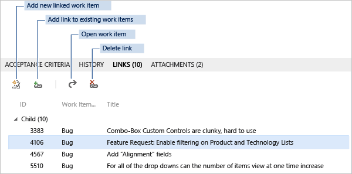
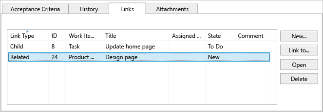
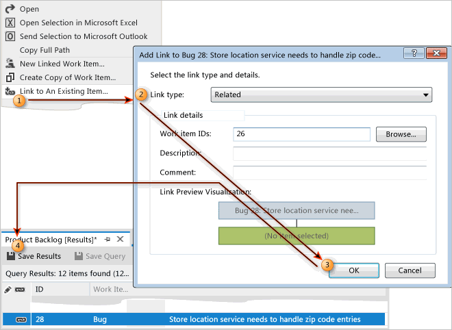
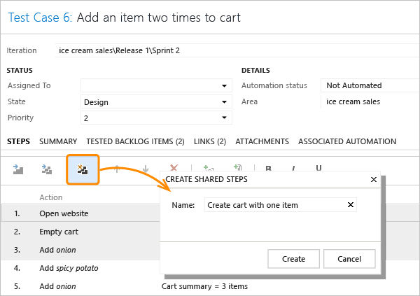
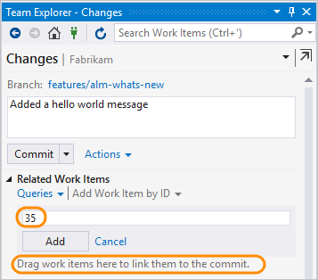
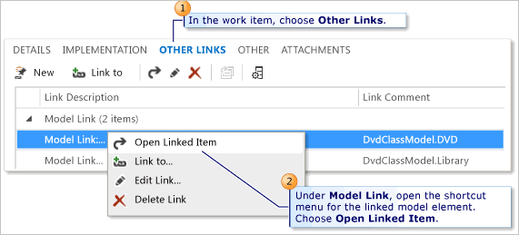
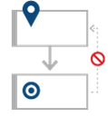
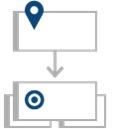

# Link work items to support traceability and manage dependencies  

**Team Services | TFS 2017 | TFS 2015 | TFS 2013**

By linking work items and other objects, you can track related work, dependencies, and changes made over time. All links are defined with a specific link type. For example, you can use Parent/Child links to link work items to support a hierarchical tree structure. Whereas, the Commit and Branch link types support links between work items and commits and branches, respectively.    

In a nutshell, you can:

- Link work items to other work items
- Link work items to test cases, and test cases to other test items and test results  
- Link work items to code-related objects such as branches, commits, pull requests, and more 
- Link select git code-related objects to builds  
- Link work items to a web address or to a storyboard or a document on a network share 
- Link work items to architecture diagrams (requires Visual Studio Enterprise edition).      

Below, you can learn how to link objects and which link types to use. You can link objects from the web portal or Visual Studio Team Explorer.  

>[!NOTE]  
><b>Feature availability: </b> Work item forms and features available to you can differ depending on whether you connect to Team Services or an on-premises Team Foundation Server (TFS), and whether you open the form from the web portal or Visual Studio Team Explorer. 

This topic describes the link types available for your use. For details on linking work items, see [Add link to work items](../backlogs/add-link.md).  

## Link work items to other work items  

There are several system link types used to link work items to each other: two tree topology, one dependency topology, and one network as indicated in the table. Tree topology links support nested hierarchies, tree queries, and several reports. Dependent links support tracking tasks that must be completed before others can be started. And, the **Related** link type supports connecting work items that are at the same level.

  

All two-way link types are characterized by a *Forward* and *Reverse* name, such as Parent/Child and Duplicate/Duplicate Of. When you link using one of these names, the linked work item is updated to include a link with the corresponding link type. For example, if you add a Parent link to a work item, the linked work item contains a Child link. 

As a quick reference guide, use the following link types as indicated: 

- Use the **Duplicate** link type when two work items have been created that essentially capture the same information; close one of the work items and keep the other one active  
- Use the **Parent/Child** link types when you want to break down work items into smaller items&mdash;for example, break down features into stories, or stories into tasks
- Use  **Predecessor-Successor** link types when you want to track tasks that must be completed before others can be started; this link type is most often used when you plan work using Project 
- Use the **Related** link type when the work items being linked are at the same level&mdash;such as two user stories that define features that overlap one another&mdash;or to link work items that are defined in different team projects or managed by different teams.

For additional guidance on choosing link types, review the [Link type descriptions and guidance](#link-type-guidance) in the related notes section. 

You can create links from within a work item form, from a work item that appears in a list of query results, in Microsoft Excel, or in Microsoft Project. You can also use any of the client programs for Team Foundation, such as Team Explorer and the web portal, to create links or attach files.

Also, you can use the context menu in the web portal or Team Explorer.

> [!NOTE]
> For each work item, you can add a maximum of 5000 links to other work items.  

## Add a link from one work item to another work item  

You can create links between work items by using one of the links control tabs within a work item form. The user interface to link a work item differs based on the platform, version, and client you use. To link several work items to a new or existing item, see [Add link to work items](../backlogs/add-link.md). 

[!INCLUDE [temp](../_shared/image-differences.md)]

### Team Services
<a id="team-services-link" /> 

From the new work item form (available from the web portal of [Team Services and TFS 2017](../process/new-work-item-experience.md)), you can add a link using the **Related Work** section or from the **Links** tab.

Open a work item and click the  icon to add a link. 
   

Choose **Existing item** to link to a work item or other object using any supported link type. Choose **New item** to initiate a link and define a new work item at the same time. For details, see [Add link to work items](../backlogs/add-link.md).

From the **Related Work** or **Links** tab, you can also perform these actions: 

- Open an associated item or object: click the linked item</li>
- Delete a link: highlight it and click the  delete icon</li>

From a query results page, you can also perform these actions: 
- Link selected items to a new work item  </li>
- Link selected items to an existing work item </li>  

For details, see [Add link to work items](../backlogs/add-link.md#link).

<a id="tfs-portal-link" />
### TFS 2015, TFS 2013 (Web Portal) 

If you connect to the web portal for TFS 2015 or earlier versions, you can link work items to other work items or supported objects from one of the available link tabs. Some work item types have two or more link control tabs. Each tab is designed to support specific types of links and restricts the types of link relationships made.
 
Open a work item and click one of the Links tab. From the links control tab you can link to a new or existing work items, open the linked object, or delete a link.

  

<a id="team-explorer-link" />
### Visual Studio, Team Explorer  

If you primarily work in Visual Studio or Team Explorer, and want to link work items, you can do so in a number of ways. Depending on the work item form and customizations that may have been made to your work item form, you may see several Link tabs. Link tabs can be customized to allow or restrict specific link types.  

Open a work item and click the Links tab. From the links control tab you can link to new or existing work items, open the linked object, edit the link type, delete a link, or open the list of links in a query or Excel or Project.

  

### Team Explorer Everwhere**

Open a work item and click the Links tab. From the links control tab you can link to new or existing work items, delete a link, or open the linked object.

  

**Link a work item to an existing work item (Team Explorer)**

From the Query Results view, you can link a work item to a new or existing work item. Click the work item you want to link, open the context menu for that work item and (1) click Link to an Existing Item... (2)Fill out the dialog that appears, (3) click Save, and then (4) Save Results to save the changes made to the work item. 

## Link or change parent-child links between work items

These features let you quickly link or change links that use the parent-child link type:

-   To link backlog items to portfolio backlog items or to change the link structure among these items, [use the mapping pane to organize your backlog](../backlogs/organize-backlog.md).
-   To create and link tasks to backlog items, [use the sprint backlog page](../scrum/sprint-planning.md); from the web portal you can also drag-and-drop items to change the link structure. 
-   To indent (), outdent (), and change the link structure of a tree hierarchy, you can [re-parent and reorder items from a backlog in the web portal](../backlogs/organize-backlog.md#reparent) or use a [tree query in Team Explorer](using-queries.md#tree-query).

You can also use Excel or Project to change the link structure. See [Bulk add or modify work items with Excel](../office/bulk-add-modify-work-items-excel.md) and [Create your backlog and tasks using Project](../office/create-your-backlog-tasks-using-project.md).

## Link test cases, shared steps, and test results

You can link work items to test cases using the **Tested/Tested By** link types. You use the same link controls you use to link work items to other work items as [described earlier](#link-work-items). 

The following image shows the full set of link types used in linking test management work item types. most links between test management artifacts occur by executing a task from the Test hub or Microsoft Test Manager. 

For example, when you add Shared Steps to a Test Case, they are automatically linked using the **Test Case/Shared Steps** link types. See [Share steps between test cases](../../manual-test/mtm/share-steps-between-test-cases.md). 

**Test case work item form (web portal for TFS 2015)**

 

From the Test hub you can add test plans, test suites, and test cases&mdash;which are linked, but not through a specific link type. Also, the test system creates and manages the associations of test results to test cases and test plans. 

## Link work items, code artifacts, and builds  

As you develop your software, you can capture which code changes and builds support the completion of a work item. In this way, your team can understand what work was done or how a bug was fixed through the audit trail of changes to the code base. The link types used to construct these links&mdash;as illustrated in the following image&mdash;are: Branch, Build, Changeset, Commit, Found in build, Integrated in build, Pull Request, and Versioned Item. 

 

>[!NOTE]  
>The link types, **Found in build** and **Integrated in build** are available from Team Services and only work with the current build processes (not XAML builds). To learn more about using these link types, see [Drive Git development from a work item](../backlogs/connect-work-items-to-git-dev-ops.md).   

You can add a link from the work item to the supported artifacts using the method [described earlier for linking work items](#link-work-items). However, an easier method is to add the work item ID to a commit, pull request, changeset, or other supported Git or TFVC operation at the time you create those items. Also, you can link work items from the Development section within the [new work item form](../process/new-work-item-experience.md). 

## Link work items and Git code development  

The recommended method is to drive development from the work item or add the work item ID when creating branches, commits (git), changesets (TFVC), pull requests (git). 

Git lets you link work items to commits by using the **Commit** link type. You can do this in several ways:

- In Visual Studio Team Explorer, add work item IDs before you commit your changes  
	  
- You can use the [git-commit](http://git-scm.com/docs/git-commit) command and include the work item ID in your comment. For example, you apply this comment #35 Catch null exception to your commit. When you push the commit, the system creates a Commit link between the commit and work item #35. 
- And, with the new work item form (available from Team Services or TFS 2017), you can [drive your git development from the work item](../backlogs/connect-work-items-to-git-dev-ops.md) as shown in the following image.  

	   

## Link work item and TFVC code development  

Team Foundation version control (TFVC) lets you link work items to version control changesets or versioned source code files by using the **Changeset** and **Versioned Item** link types. When you check in pending changes or use My Work to check in changes, [work items are automatically linked to your changes](../../tfvc/check-your-work-team-codebase.md).

  

## Link to a Web site, network share, storyboard, or document 

You can use the Hyperlinks or Storyboard link type to link a work item to a Web site, network share, or document located on a network share. Both of these link types are one-way links. To add links of this type, you can use the same links controls [described earlier for linking work items](#link-work-items). 

For TFS 2015 and earlier versions, select work item types may show a Storyboards tab which you can use to link to Storyboards.  

 

From the **Storyboards** tab, you can link storyboards that you created using PowerPoint Storyboarding or other application. The Storyboards tab and links control is only available from the web and client work item form for TFS 2015. However, you can still use the Storyboard link type from Team Services and the web portal of TFS 2017 and later versions.

For process templates associated with TFS 2015 and earlier versions, the  **Storyboards** tab links control was added to those work item types used to defined requirements, user stories, or features. When you make changes to a linked storyboard, the work item continues to link to the file with the latest changes.

By using the Storyboard link type, you differentiate the link your adding to specify a storyboard or document that provides work item specifications. Use this link type to provide your team access to the shared file where they can add their comments. You can also link from a Power Point file to Team Services using this link type as described [Storyboard your ideas using PowerPoint](../office/storyboard-your-ideas-using-powerpoint.md).

## Link work items to architectural diagrams

You choose the **Model** link type when you want to link a work item to an architectural diagram created using Visual Studio Enterprise. This link type is only available when you work from Visual Studio Enterprise. With this link type, you can  track tasks, test cases, bugs, requirements, issues, or other kinds of work that are associated with specific parts of your model. 

 

To link a work item to a diagram, open the work item in Visual Studio, choose the **All Links** or **Other Links** tab and choose the **Model** link type. You can also open the linked diagram from the links tab. 

Or, you can link a model element to a work item. See [Link model elements and work items](https://msdn.microsoft.com/library/dd465152.aspx).

## Query for linked work items 

To filter items based on hierarchical links, use the **Tree of work items** query type. To filter items based on all link types, use **Work items and direct links**. 

You can search for work items that not only meet criteria for field values but also that are linked to other work items with specific types of links. This kind of query displays a primary set of work items, which meet the field criteria, and a secondary set, which are linked to items in the primary set.

For query examples, see [Link and attachment queries](linking-attachments.md).

> [!NOTE]  
> You can't construct a query that shows a hierarchical view of Test Plans, Test Suites, and Test Cases. These items aren't linked together using Parent/Child or any other link type. You can only view the hierarchy through the [Test Plans page of the Test hub](../../manual-test/getting-started/create-a-test-plan.md). 

## Link type descriptions and guidance 
 
Link types you use to link work items are subject to certain restrictions based on their topology. Use the guidance provided in the following table to choose which link type to use based on the types of queries and reports you'll want to create. To learn more about link type restrictions and topologies, see [LinksControlOptions elements](../reference/link-type-element-reference.md#topology).

<table>
<tbody valign="top">
<tr>
<th width="35%">Link type</th>
<th width="65%">Usage</th>

<tr>
<td>**Affects-Affected by** (Dependency topology, CMMI only)   
 
 
</td>
<td>

Use this directional link to create links between any set of work items, but not ones that would create closed loops.  Typically used to track change requests made to requirements.

Restrictions and recommendations:
<ul>
<li>
You can link a change request to only one requirement using Affects. You can link requirements to as many child change requests as needed using Affected by.

</li>
<li>
Only use Affects-Affected by links to link work items in the same team project. This action is recommended if you plan to use Excel or Project to modify or update work item data.
</li>
</ul> </td>
</tr>

<tr>
<td>**Child-Parent** (Tree topology)  
 
 
</td>
<td>

Use this directional link to create one-to-many relationships between a single parent to one or more child items. Typical uses include:  
<ul>
<li>
Create a work breakdown structure (WBS). See [Schedule tasks and assign resources using Microsoft Project](../office/create-your-backlog-tasks-using-project.md).
</li><li>
Map backlog items to portfolio backlog items. Mapping items automatically creates parent-child links between the items. To learn about mapping, see [Organize your backlog](../backlogs/organize-backlog.md).
</li><li>
Maintain task summary relationships. Parent-child links are created for summary tasks and their subordinate tasks.
</li><li>
Link tasks to PBIs, user stories, or requirements. Supports Backlog Overview, Stories Overview, and Requirements Overview reports.
</li></ul>Restrictions and recommendations:<ul><li>
Use Excel to bulk edit both work items and parent-child links. See [Bulk add or modify work items with Excel](../office/bulk-add-modify-work-items-excel.md).
</li><li>
A work item can have only one Parent. A parent work item can have many children.
</li><li>
Only use parent-child links to link work items in the same team project. This action is recommended if you plan to use Excel or Project to modify or update work item data.
</li></ul> </td>
</tr>

<tr>
<td>**Duplicate-Duplicate of** (Tree topology)  
 
 
</td>
<td>

Use this directional link to create one-to-many relationships between a single parent to one or more child items. Use to track tasks, bugs, or other work items which are duplicates of one another.  

Restrictions and recommendations:

<ul><li>
A work item can have only one Duplicate. 
</li><li>
Only use Duplicate/Duplicate Of links to link work items in the same team project. This action is recommended if you plan to use Excel or Project to modify or update work item data.
</li></ul> </td>
</tr>

<tr>
<td>**Successor-Predecessor** (Dependency topology) 
 
 

</td>
<td>
Use this directional link to create links between any set of work items, but not ones that would create closed loops. Typically used to track work that must be completed prior to beginning work on predecessor items.

<ul><li>
Track tasks that must be completed before others can be started. When you plan work using Project, linked tasks are represented as predecessor-successor links in TFS.
</li><li>
Supports one-to-many relationships.
</li><li>
Find and view predecessor work items and their successor work items in a two-tiered, direct links query view.
</li></ul>Restrictions and recommendations:<ul><li>
An error appears when you attempt to create links that define circular relationships.
</li><li>
Create predecessor-successor links only to work items that are within the same team project. 
You can create predecessor-successor links between work items that are defined in different projects. However, if you export a query to Excel or Project, only those work items that are defined for the team project for which the query is defined are imported into the Team Foundation client.
</li></ul> </td>
</tr>

</tr>
<tr>
<td>**Related** (Network topology)  
 

</td>
<td>Use this non-directional link to create links between any set of work items.  

<ul><li>
Relate work items that are at the same level, such as two user stories that define features that overlap one another.
</li><li>
Link work items that are defined in different team projects and managed by different teams.
</li><li>
Find and view work items and their related work items in a two-tiered view.
</li><li>
Create simple relationships with few restrictions.
</li></ul></td>
</tr>

<tr>
<td>**Tested by-Tests** (Dependency topology)  
 
 
</td>
<td>

Link test cases to work items, such as bugs, user stories, requirements, and product backlog items. For on-premises TFS, there are several SQL reports that depend on these links. See [Review team activities to support useful reports](../../report/admin/review-team-activities-for-useful-reports.md#monitor-progress)

</td>
</tr>

<tr>
<td>**Test Case-Shared Steps** (Dependency topology)  
 
 
</td>
<td>

Use to link test cases to shared steps. To learn more, see [Share steps between test cases](../../manual-test/mtm/share-steps-between-test-cases.md).

</td>
</tr>

<tr>
<td>**Referenced By-References** (Dependency topology)  
 
 
</td>
<td>

Use to link test cases to shared parameters. To learn more, see [Repeat a test with different data](../../manual-test/repeat-test-with-different-data.md). 

</td>
</tr>

</tbody>
</table>

## Related notes 

You should now have a broad understanding of the various link relationships you can create to track dependencies and create an audit trail for your code development.

Once you've formed a link relationship, you can't edit the link type of that relationship from the web portal, but you can do it from Team Explorer. 

For additional information, see these topics: 

- [Add link to multiple work items](../backlogs/add-link.md)  
- [Share plans, add attachments](share-plans.md)  
- [Use mapping to link backlog items to features and epics](../backlogs/organize-backlog.md)
- [Bulk modify links using Excel](../office/bulk-add-modify-work-items-excel.md)  

### Visualize related work and other objects 

You can view related work items and object within a work item form by installing the [Work item visualization extension](https://marketplace.visualstudio.com/items?itemName=ms-devlabs.WorkItemVisualization) available from the Visual Studio Marketplace. 

### Customized link types (TFS) 

If you connect to an on-premises TFS, you can create custom link types; export and import definitions of link types; and delete, activate, deactivate, and reactivate types of links. See the following topics:  

- [Link type element reference](https://msdn.microsoft.com/library/dd293527.aspx) 
- [Manage link types (witadmin)](https://msdn.microsoft.com/library/dd273716.aspx) 

