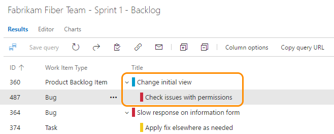

# Fix "Ordering backlog items is disabled" 

When a sprint backlog contains same-category, nested  work items&mdash;as described in the next section, [How backlogs and boards display hierarchical (nested) items](#nested)&mdash;the system disables the drag-and-drop reorder feature. It does this as it determines that not all items display under these circumstances.  

To fix this, take the following actions: 

1. Click the **Create query** link on the backlog page. 
    
	

2. Open the query (click the link that appears). 

3. Review the list of items to determine which items are nested. For example, the following query shows that a bug is a child of a user story. Because the team has configured their backlog to display user stories and bugs at the same level (Requirements category), this corresponds to a nested item that disables the ordering feature. 

	

4. Remove all parent-child links that exist among nested items. 

5. Return to the backlog page and refresh the page. 

## How backlogs and boards display hierarchical (nested) items 
 
While you can create a hierarchy of backlog items, tasks, and bugs&mdash;we don't recommend that you create same-category hierarchies. That is, don't create parent-child links among work items of the same type, such as story-story, bug-bug, task-task. The reason is that the Kanban board, sprint backlog, and task board only show the last node in a same-category hierarchy, called the leaf node. For example, if you link items within a same-category hierarchy that is four levels deep, only the items at the fourth level appear on the Kanban board, sprint backlog, and task board.  

Instead of nesting requirements, bugs, and tasks, we recommend that you maintain a flat list. In other words, only create parent-child links one level deep between items that belong to a different category. Use the Feature work item type when you want to group user stories (Agile), product backlog items (Scrum), or requirements (CMMI). You can [quickly map product backlog items to features](../backlogs/organize-backlog.md), which creates parent-child links in the background.    

 

## When you track bugs as requirements

As mentioned previously, [each team can choose how they want to track bugs](../customize/show-bugs-on-backlog.md) to behave like requirements, or tasks, or as neither. 

When you make a bug or requirement a child of another bug or requirement, all items appear on the product backlog page, but only the child bug or requirement appears on the Kanban board. For example, the third user story, *Interim save on long form*, has a child bug, *Save takes too long*. 

The child bug, *Save takes too long*, appears on the Kanban board, but not the parent user story.  

**All bugs and requirements appear on the backlog**  

  

**Only leaf nodes appear on the Kanban board**  

  

## When you track bugs as tasks

When you choose to have bugs appear in the backlog with tasks, linking tasks and bugs to their parent requirements groups them accordingly on the sprint backlog and task board.  

However, if you create parent-child links between a requirement and a bug, and the bug and a task, as shown here, the task will appear on the sprint backlog and task board, but not the bug. 

**Hierarchy of items assigned to the sprint backlog**  

   

**Only leaf nodes appear on the sprint backlog**  

  

**Only leaf nodes appear on the task board**   
  

Is there a workaround to display intermediate nodes within a hierarchy?  Not at this time. You can always check the entire list of items assigned to a sprint by using the **Create Query** link. 

## Related notes

- [Backlogs, boards, and plans](../backlogs-boards-plans.md) 