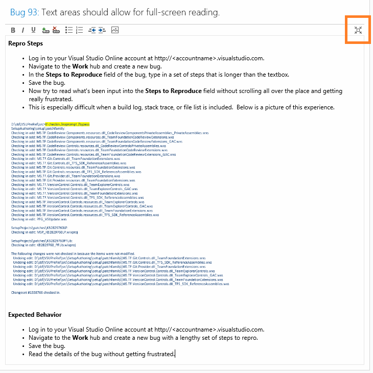
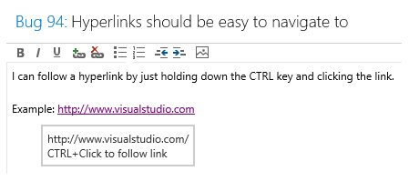

#Work item improvements - Sep 23

**Note**: The improvements discussed in this post will be rolling out throughout the week. Please follow progress of the deployment at [http://blogs.msdn.com/b/vsoservice/](http://blogs.msdn.com/b/vsoservice/).

This week’s deployment has a few work items usability improvements I’m sure you’ll appreciate. Let’s take a look.

##Maximizing text area fields

We’ve added a new “maximize” command to all text area controls to help improve the readability and usability of long text fields. Whether you’re triaging a bug with an embedded stack trace or reviewing a backlog item with a lengthy description, it can be very frustrating to have to scroll within a tiny viewport to get the information you need. See the **Steps to Reproduce** field in the screenshot below.

Today’s update adds a new maximize command to each text area control allowing you to expand the text area to fill your viewport for improved readability. Click it once to maximize, click it again or use the ESC key to return to the full work item view.

##Navigating to links

We also made a simple improvement to allow you to follow a hyperlink embedded in a text area control by holding down the CTRL key and clicking the link.  Previously, you were forced to click the link and then select a “navigate to…” command at the top of the text area. Today’s change should feel much more natural and familiar.

##Work item performance improvements

And last but not least, we made a few performance optimizations to ensure work items are loading fast. We changed our rendering logic to only load controls for the data present on screen, rather than rending and then hiding controls for data on additional tabs. We applied similar logic to the query tree folder. We now load the queries and folders progressively as you drill through, instead of loading the entire tree folder every time you navigate to the queries hub. If you have a very deep query folder tree with hundreds (if not thousands) or queries, you should notice a substantial improvement. That’s it for Sprint 71. Let us know what you think on [Twitter](https://twitter.com/VisualStudio) and [UserVoice](https://visualstudio.uservoice.com/forums/330519-vso).

Thanks,

Aaron Bjork