#New navigation, Test & Feedback extension GA, and cherry-pick – Oct 12

**Note:** The improvements discussed in this post will be rolling out throughout the next week.

We have a lot of new features rolling out this sprint!

##New navigation experience is On by default
In mid-August, we enabled an opt-in mode allowing customers to preview our new navigation experience as detailed by Brian Harry on his [blog](https://blogs.msdn.microsoft.com/bharry/2016/08/18/new-navigation-for-team-services/). We’ve collected feedback and made refinements since then, preparing the feature for broad availability. I am happy to announce that with this sprint’s deployment, we will be defaulting to the new navigation experience on all accounts. We’ve made this decision based on the following data:
* 93% of users that opted into the new nav did not return to the previous version, aligning with the positive user feedback we received 
* 30%+ of the web traffic is now serving the new nav, and this number continues to grow. This gives us both confidence on quality and significant coverage of use cases
* Since the opt-in release, over 20 usability and bug fixes have reported by users and all have been addressed

The most constructive feedback we have received is that users want to manage this change, and we need to be respectful of that. In this sprint, we are still allowing users to opt out of the new experience. This provides admins and users with a window to prepare and accommodate their teams for the change. Our current plan is to remove the previous nav next sprint, and continue to innovate our navigation using the new navigation experience as the base going foward.

##Cherry-pick and revert

We’ve added two new features that make it easier to port or back out changes from the web portal: Cherry-pick and Revert.  

Use the cherry-pick command to port changes in a pull request to multiple branches.  A typical use case is when a bug needs to be hotfixed, but should also be fixed in the mainline.  Once you’ve created your pull request that contains the fix to the hotfix branch, you can easily cherry-pick the same fix into the master branch.  If the PR is active, you can find the __Cherry-pick__ command on the context menu.

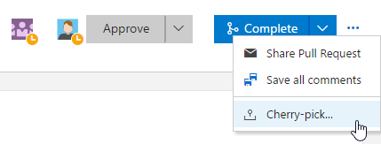

If you want to cherry-pick a change from a completed PR, the command will appear alongside the completion message.

In both cases, you’ll be directed to an experience that applies the change to a new branch and sets up the PR.  

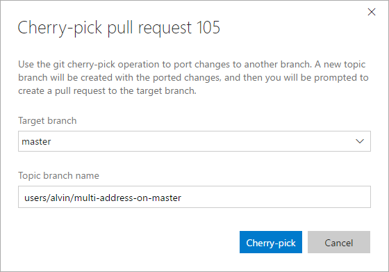

You can revert changes on completed PRs.  Find the PR that introduced the bad change, click __Revert__, and follow the steps to create a PR that backs out the unwanted changes.  

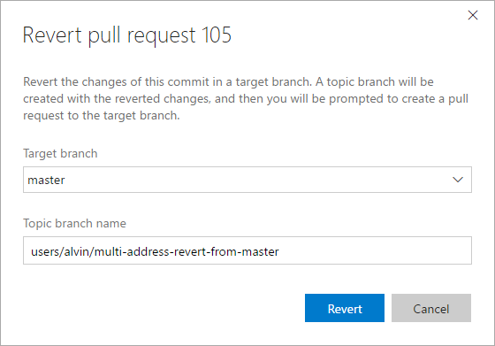

If you have ideas on things you’d like to see, head over to [UserVoice](https://visualstudio.uservoice.com/forums/330519-team-services) to add your idea or vote for an existing one.

##Commit page improvements
We are making the user experience of the commit details page and commit history page modern and highly performant. You will be able to find and act on important information related to the commit at a bird’s-eye view. 

Here is an example of the commit details page:

Here is the commit history page:

##Configurable compare branch
You can now set your compare branch to something other than the default branch. This setting will be remembered on a per-user basis. Pull requests and new branches created from the __Branches__ page will be based off the branch you set as the compare branch.

Your default branch will automatically be set as the compare branch as denoted by the badge.

You can change the compare branch by selecting __Set as compare branch__ in the context menu.

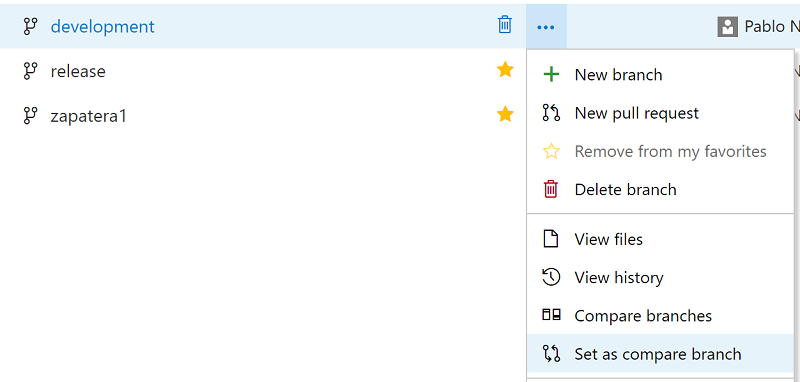

You will then see the compare branch appear at the top of your __Mine__ and __All__ views.

##Find a file or folder
You can quickly search for a file or folder in a repository using the __Code__ hub in your Team Services project. The result lists items from your current folder followed by files and folders across the repository.

For any Git repository, go to the path control box, and start typing to initiate a navigation search experience for the file or folder you are looking for. 

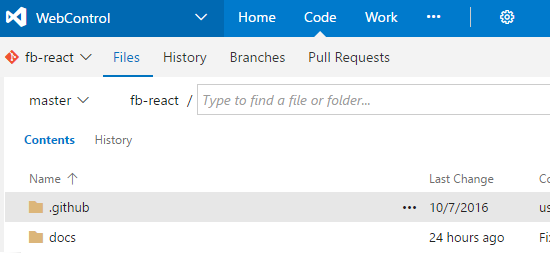

For those of us who love keyboard shortcuts, we added the functionality in the __Code / Files__ view to launch the Find a File experience by just hitting “t” on any repos Files view. With the up/down arrows, you go up and down the results, click or press Enter to open a result, or with Esc, you close the Find a File experience. 

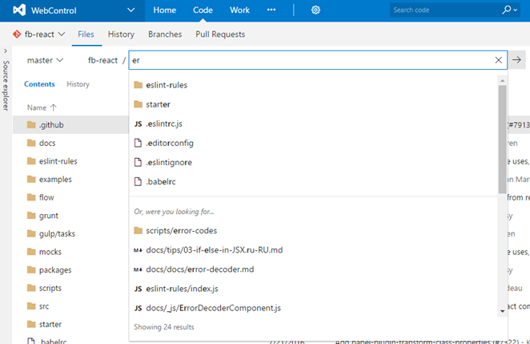

##Suggested value in work item pick lists
Custom picklist fields can be configured to allow users to enter their own values beyond the provided list values in the picklist field. 

This feature also enables users to use picklist fields with the multi-value control extension available in the [marketplace](https://marketplace.visualstudio.com/).

##Xcode 8 signing and exporting packages in the Xcode Build Task
The Xcode task now supports building your projects using Xcode 8 automatic signing. You can install the certs and provisioning profiles on the build server manually, or have the task install them by specifying the __File Contents__ options.

Xcode 8 requires specifying an export options plist when exporting an app package (IPA) from an archive (.xcarchive). The Xcode task now automatically identifies the export method if you are using Xcode 8 or Xcode 7. You can specify the export method or specify a custom plist file from the Xcode task. If you are using an Xcode version older than Xcode 7, the task falls back to using the old tool (xcrun) for creating the app package.

##FindBugs in the Gradle build task
You can now request FindBugs standalone static analysis in the Gradle build task (in addition to the PMD and Checkstyle analysis). The results of the static analysis appear in the build summary, and resulting files are available from the __Artifact__ tab of the build result.

For more details see [Maven and Gradle build tasks support powerful code analysis tools](https://blogs.msdn.microsoft.com/visualstudioalm/2016/10/12/maven-and-gradle-build-tasks-support-powerful-code-analysis-tools/).
##Build improvements

###Visual Studio “15” build task
The Visual Studio Build and MSBuild tasks can now locate Visual Studio “15” installations.  You no longer need to explicitly specify the path to MSBuild.exe 15.0 in your build configuration.

###git-lfs and shallow clone
The 2.107.x build agent now supports Git shallow clone and git-lfs.  More details are at https://www.visualstudio.com/en-us/docs/build/define/repository.

###Updated hosted build pool
The hosted build pool has been updated:
* Azure SDK 2.9.1
* WIX 3.10
* SQL lite for Windows Phone 8.1
* Xamarin Stable Cycle 8 SR 0
* Windows 10 SDK 14393
* .NET 4.6.2
* Git 2.10.1

### New places to search
You can now search for builds in the __Mine__ and __Queued__ tabs.

##Email support for AAD groups
This feature enables you to @mention and receive emails from AAD groups which you are in.

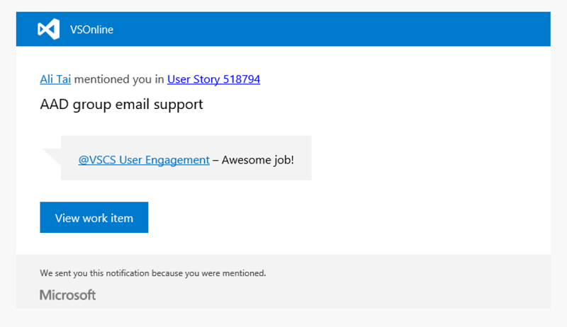

##Multiple schedules in releases
Want to schedule your releases to be created more than one time in a day? You can now configure multiple scheduled triggers in a release definition.

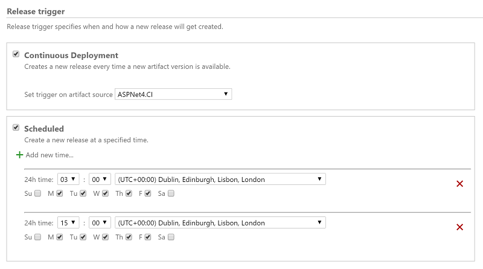

##Azure resource group improvements
Currently, when using the Azure resource group task, there is no way to validate if the ARM template is syntactically correct and would be accepted by the Azure Resource Manager without actually deploying the resources. This enhancement allows a new deployment mode called __Validation Only__ where users can find problems with the template authoring before creating actual Azure resources.

Another enhancement to the Azure resource group task is to allow either incremental or complete deployments. Currently, the task deploys the ARM templates using the Incremental mode. Incremental mode handles deployments as incremental updates to the resource group. It does not modify resources that exist in the resource group but are not specified in the template. Complete mode deletes resources that are not in your template. By default, incremental mode is used.

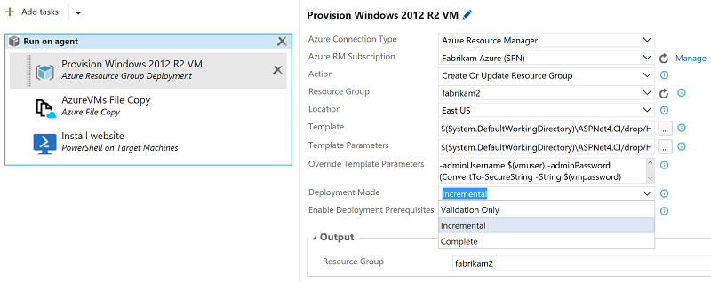

##Azure CLI task
The new Azure CLI task supports running Azure CLI commands on cross platform agents like Windows, Linux and Mac. The task supports both Classic and ARM subscriptions. It supports two modes of providing the script, one as a linked artifact and another as an inline script.

##Simplified Azure endpoint creation
In an earlier sprint, we made it easier to create a new Azure Resource Manager service endpoint from Team Services. That experience only worked in accounts that are backed by an Azure Active Directory. In this deployment, we are bringing the same simplified experience for all the other accounts that are not backed by an AAD. So, if you are a MSA user and have an Azure subscription that you would like to deploy to from Team Services, you can create an Azure endpoint without having to run tedious Powershell scripts or following a blog.

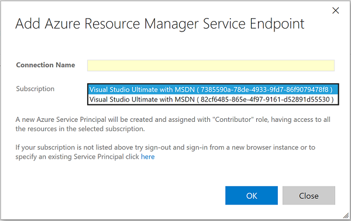

##Test & Feedback extension general availability

We are pleased to announce that __Exploratory Testing__ extension is now __Test & Feedback__ extension and is free for all.  You can find more information in the [blog post](https://blogs.msdn.microsoft.com/visualstudioalm/2016/10/08/test-feedback-overview/).

##Testing improvements
###Update existing bugs from Web Runner
In addition to creating new bugs from the Web runner, now you can also update an existing bug.  All the diagnostic data collected, repro steps, and links for traceability from the current session are automatically added to the existing bug.

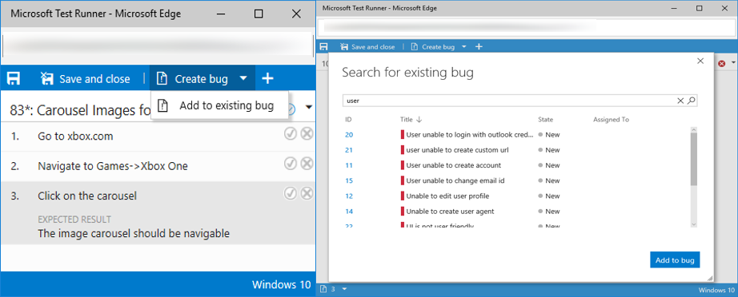

###Test hub contribution point
We have added a new contribution point (“ms.vss-test-web.test-plan-pivot-tabs”) within the __Test plan__ hub to allow developers to write extensions as a pivot tab, that appears next to the __Tests__ and __Charts__ tab.

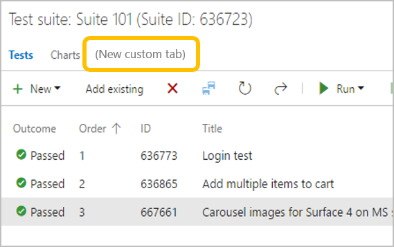

###Visual Studio subscribers automatically use their free license
VSTS will now automatically recognize Visual Studio subscribers as they log into their Team Services account. This will override the Stakeholder access level as well as free up a Basic access level for the account.

For this reason, there is no longer a need to assign users the Eligible Visual Studio/MSDN subscriber from the drop down menu.

As always, if you have ideas on things you’d like to see us prioritize, head over to [UserVoice](https://visualstudio.uservoice.com/forums/330519-vso) to add your idea or vote for an existing one.

Thanks,

Jamie Cool
